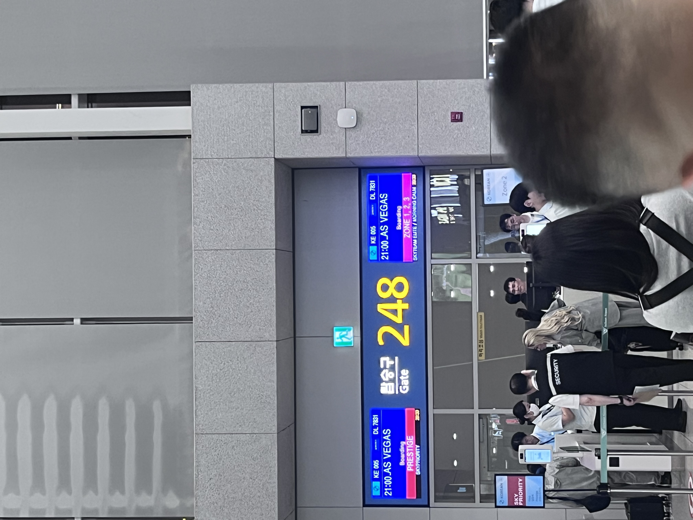
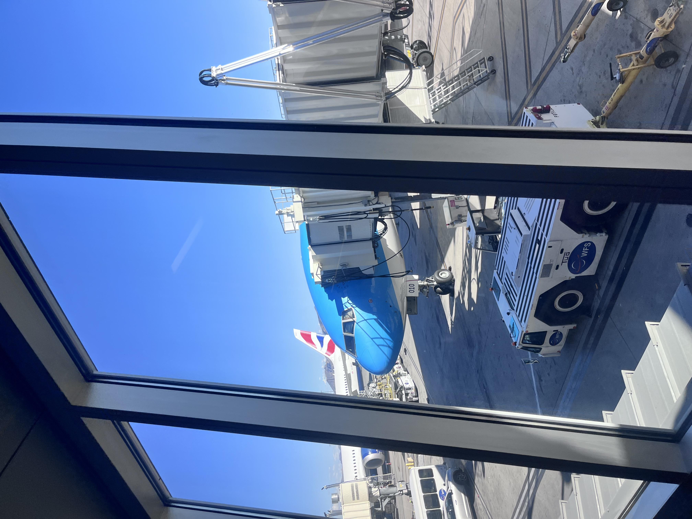
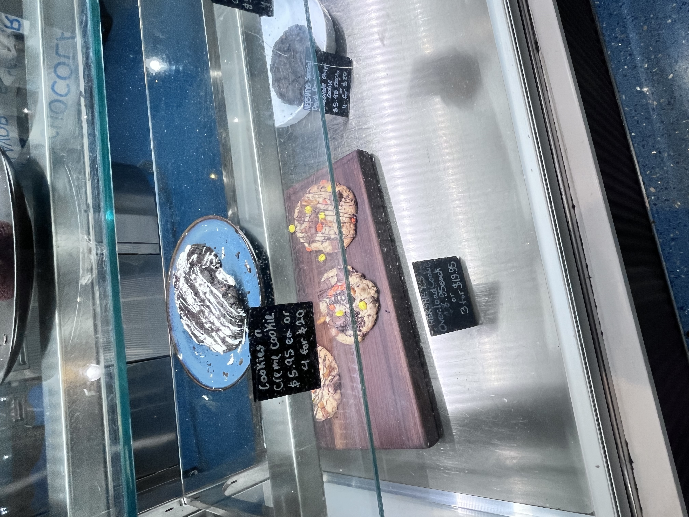

회사 지원으로 해외 컨퍼런스에 참여할 기회가 생겼다. 목적지는 라스베이거스, 행사는 **dbt Summit 2026**. 컨퍼런스에서 보고 들은 이야기를 쓰기 전에, 우선 한국에서 출발해 라스베이거스에서 첫날을 보낸 이야기부터 남겨보려 한다.

이번 후기는 출국과 도착, DBT 컨퍼런스 1~4일차, 그리고 한국으로 돌아온 뒤의 느낀 점까지 순서대로 이어갈 예정이다.

## 출국 네 시간 전을 목표로

공항에는 출국 네 시간 전에 도착할 생각이었다. 면세품도 수령해야 했고, 스카이허브 라운지에서 여유 있게 밥을 먹고 쉬다가 비행기를 타고 싶었다. 공항에서부터 뛰어다니며 시작하고 싶지는 않았다.

_여유 있게 시작하려고 일찍 나선 출국길._

그런데 수속이 생각보다 훨씬 빨랐다. 체크인부터 출국 수속까지 쭉 진행하고 나니, 30분 만에 면세구역에 들어온 것 같았다. 넉넉하게 잡아둔 시간이 그대로 여유 시간이 됐다.

스카이허브 라운지에서 배부르게 먹고, 면세품도 수령했다. 출국 전에 하려고 했던 일을 마치고 나니 이제 정말 비행기에 타는 일만 남았다.

## 넓은 자리, 그리고 잠들지 못한 비행

이번에 탄 비행기는 대한항공이었다. 출발 전에는 스타링크 와이파이를 쓸 수 있다는 이야기를 듣고 은근히 기대했는데, 아쉽게도 이번 비행에서는 사용할 수 없었다.

대신 좌석에서 뜻밖의 행운이 있었다. 감사하게도 항공사 직원분이 비상구 자리로 바꿔주셨다. 긴 비행을 앞두고 다리를 조금 더 편하게 둘 수 있다는 것만으로도 반가운 일이었다.

_라스베이거스로 향하는 비행기에 탑승할 시간._

자리는 편해졌는데, 이상하게 잠은 잘 오지 않았다. 조금이라도 자두면 도착해서 덜 피곤할 텐데, 결국 잠을 거의 못 잔 채로 비행을 마쳤다. 몸은 라스베이거스에 도착했지만 정신은 아직 비행기 안에 남아 있는 듯한 몽롱한 상태였다.

_긴 비행 끝에 도착한 해리 리드 공항._

## 코스모폴리탄 체크인과 20달러

이번 숙소는 dbt Summit이 열리는 **코스모폴리탄 호텔**이었다. 숙소와 행사장이 같은 곳이라는 점이 마음에 들었다. 회사에서 시티뷰 객실을 지원해줬는데, 막상 체크인하려니 조금 더 좋은 전망을 보고 싶다는 욕심이 생겼다.

그래서 여권에 20달러를 넣고, 더 좋은 뷰의 방으로 업그레이드가 가능한지 물어봤다. 직원분은 흔쾌히 가능하다고 답해주셨다. 이번에는 물어보길 잘했다.

_짐을 풀고 잠시 숨을 돌린 코스모폴리탄 객실._

_창밖으로 펼쳐진 라스베이거스 풍경._

숙소에 짐을 풀고 샤워를 했다. 비행기에서 제대로 못 잤으니 그대로 누워도 이상하지 않았겠지만, 일단 밖으로 나가보기로 했다. 호텔 문밖에는 스트립이 있었다.

## 다시 걷는 라스베이거스 스트립

라스베이거스는 올해 5월에 아내와 함께 방문한 적이 있다. 다만 그때는 LA에서 그랜드캐년으로 가는 길에 들르는 경유지에 가까웠다. 도시 자체를 구경하는 데 많은 시간을 쓰지는 못했다.

이번에는 컨퍼런스 때문에 다시 오게 됐다. 같은 도시를 몇 달 만에 다른 목적으로 찾았다는 점이 재미있었다. 첫날은 거창한 일정을 잡기보다 스트립을 걸으며 주변을 둘러봤다.

_코카콜라 스토어 앞. 거리를 걷는 것만으로도 볼거리가 이어진다._

코카콜라 스토어, 허쉬, M&M's 스토어를 둘러보고 CVS에도 들렀다. 익숙한 브랜드라도 이렇게 큰 매장과 화려한 간판으로 마주하면 자연스럽게 눈길이 간다. 이곳저곳 한 바퀴 돌다 보니 어느새 시간이 꽤 지나 있었다.

_허쉬 매장에서 구경한 쿠키들._

공항에서 일찍 시작한 하루가 긴 비행과 호텔 체크인, 스트립 산책까지 이어졌다. 첫날은 여기까지. 숙소로 돌아와 잠을 청했다.

---

**dbt Summit 2026 출장 기록**

1. **출국/도착 — 현재 글**
2. DBT 컨퍼런스 1일차 — 작성 예정
3. DBT 컨퍼런스 2일차 — 작성 예정
4. DBT 컨퍼런스 3일차 — 작성 예정
5. DBT 컨퍼런스 4일차 — 작성 예정
6. 한국 복귀와 느낀 점 — 작성 예정
