회사 지원으로 감사하게도 해외 컨퍼런스에 참여할 기회가 생겼습니다.

목적지는 미국 라스베이거스, 제가 참여하게 된 컨퍼런스는 바로 [**dbt Summit 2026**](https://www.getdbt.com/dbt-summit)입니다 !!

### dbt Labs와 Summit, 간단히 알아보기

**dbt Labs**는 데이터 변환 도구인 **DBT**를 만든 기업입니다. DBT는 쉽게 말해서 데이터팀이 분석에 필요한 데이터를 개발하고 관리하는 일을 돕는 툴입니다.

또한 **Analytics Engineer라는 직무를 정립하고 확산하는 데 기여한 기업**이기도 합니다.

- [dbt Labs의 설명](https://www.getdbt.com/blog/what-is-analytics-engineering)에 따르면, 2018년부터 Analytics Engineer라고 부르기 시작했던 것 같네요!

2019년 1월에는 [「The Analytics Engineer」](https://locallyoptimistic.com/post/analytics-engineer/)에서 이 직무의 필요성과 책임을 설명했습니다. 이런 기록을 보면, dbt Labs는 커뮤니티와 함께 이 직무의 이름과 업무 방식을 구체화한 기업이라고 소개하는 것이 정확합니다. (이런걸 보면 확실히 미국이 한국보다 확실히 빠르네요)

그리고 제가 참여한 **dbt Summit**은 데이터 실무자들이 기술과 활용 사례를 공유하는 컨퍼런스입니다. 처음부터 이 이름으로 열린 것은 아니고, 작년까지는 **Coalesce**라는 행사에서 이어졌습니다.

| 연도     | 회사와 컨퍼런스의 주요 변화                                                                                                       |
| :------- | :-------------------------------------------------------------------------------------------------------------------------------- |
| **2016** | **Fishtown Analytics 설립.** dbt와 커뮤니티를 중심으로 출발했습니다.                                                              |
| **2020** | **첫 Coalesce 개최.** 12월 7~11일 온라인으로 열렸으며, Crowdcast로 발표를 시청하고 Slack에서 대화를 나눴습니다.                   |
| **2021** | **회사명을 dbt Labs로 변경.** Fishtown Analytics에서 지금의 이름으로 바뀌었습니다.                                                |
| **2026** | **Coalesce → dbt Summit.** 행사 이름을 바꾸고, 9월 15~18일 라스베이거스 코스모폴리탄에서 키노트·세션·실습 교육 등을 진행했습니다. |

자세한 내용은 아래 링크로 갈음하겠습니다.

- 출처: [회사 연혁](https://www.getdbt.com/blog/fishtown-analytics-rebrands-as-dbt-labs-closes-150m-to-develop-open-source-analytics-engineering-software) · [첫 Coalesce 안내](https://discourse.getdbt.com/t/got-a-question-about-coalesce-2020-start-here/1628) · [Summit 명칭 변경 안내](https://www.getdbt.com/blog/what-makes-a-great-dbt-summit-presentation)

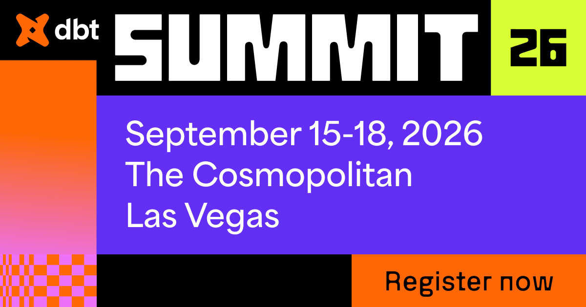

_이번에 참석한 dbt Summit 2026의 일정과 장소. [공식 행사 안내](https://www.getdbt.com/dbt-summit)._

---

### 이번 Summit에서 궁금했던 것

이번 dbt Summit에서 궁금했던 부분은 크게 세 가지였습니다.

****1. dbt가 만들어내는 데이터 자산이 어떻게 확장되고 있는지****

- 업무에서 dbt를 사용하며 메타데이터, 데이터 리니지, materialized 테이블, Test 등 다양한 데이터 자산을 생산하고 있습니다. 최근에는 이를 기반으로 Semantic Layer나 AI Agent 관련 업무도 하고 있어, 이러한 자산을 어떻게 활용하고 확장하고 있는지 궁금했습니다.

****2. AI 시대에 Analytics Engineering의 역할이 어떻게 변화하고 있는지****

- AI가 업무 생산성에 큰 영향을 주면서 데이터 직군의 역할도 다양해 지고 있다고 생각하는 편입니다. 특히 Analytics Enginner 직군은 데이터 모델링을 넘어 비즈니스 맥락을 정의하고, 이를 AI가 이해하고 활용할 수 있도록 만드는 역할이 어떻게 발전하고 있는지 직접 보고 싶었습니다. (어떤 공통의 포맷이나 거버넌스가 있을지)

****3. 실제 기업들은 Semantic Layer와 AI Agent를 어떻게 활용하고 있는지****

- 최근 Semantic Layer와 AI Agent 관련 과제를 진행하면서 다른 기업들은 비슷한 문제를 어떻게 풀어가고 있는지 궁금했습니다. 실제 사례를 통해 프로젝트를 어떤 방향으로 발전시킬 수 있을지 힌트를 얻고 싶었습니다.

컨퍼런스에서 보고 들은 이야기를 정리하기 전에, 우선 한국에서 출발해 라스베이거스에서 첫날을 보낸 이야기부터 남겨보려고 합니다.
이번 후기는 출국과 도착, dbt 컨퍼런스 1~4일차, 그리고 한국으로 돌아온 뒤의 느낀 점까지 순서대로 작성할 예정입니다.

## 공항 도착 ✈️

베리와 아내에게 작별 인사를 하고 점심 식사 후 바로 출발했습니다.

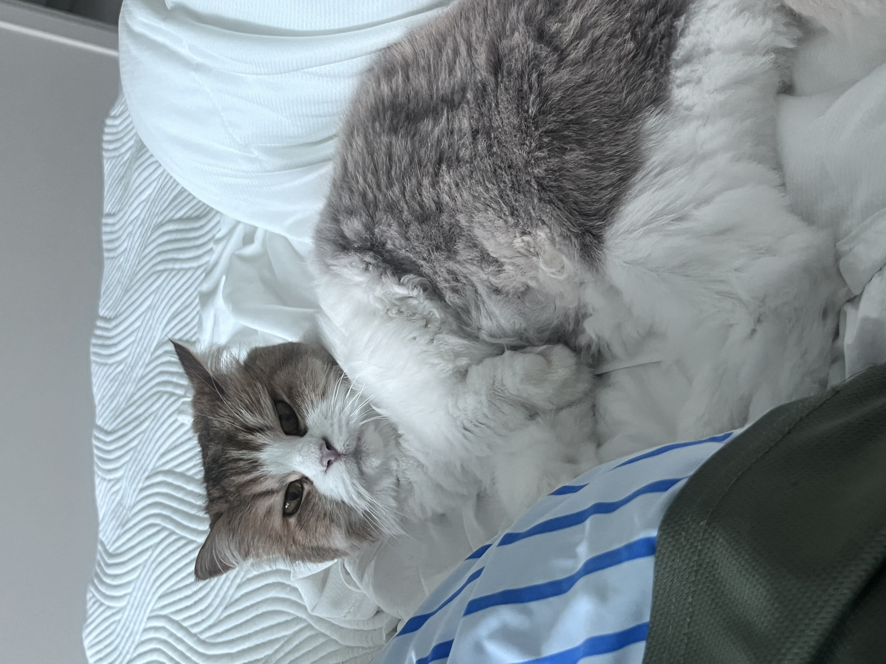

다행히 집 앞에 공항버스 정류장이 있어 편하게 인천공항에 도착할 수 있었습니다. 큰 캐리어를 들고 이동해야 해서 집 근처에서 다이렉트로 공항까지 갈 수 있다는 게 정말 편했습니다.

출국 전에 주문했던 면세품도 수령해야 했고, 라운지에서 남은 시간을 여유 있게 밥을 먹고 쉬다가 비행기를 타고 싶어서 출발 4시간 전에 도착했습니다.

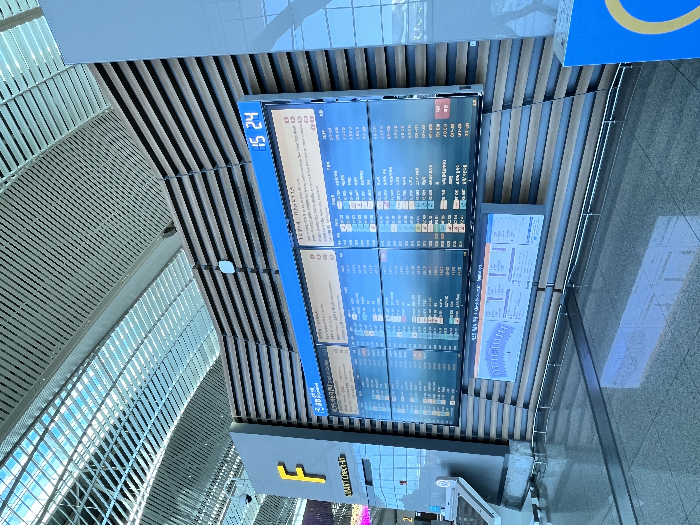

_여유 있게 시작하려고 일찍 나선 출국길._

그런데 수속이 생각보다 훨씬 빨랐습니다. 월요일이라 그런지 생각보다 사람이 없었고 체크인부터 출국 수속까지 쭉 진행하고 나니 약 30분 정도 만에 면세구역에 들어온 것 같습니다.

혹시 사람이 많을까 봐 상당히 일찍 도착했는데 오히려 시간이 너무 많이 남아버렸습니다. 그래도 장거리 비행을 앞두고 공항에서 급하게 움직이는 것보다는 훨씬 나았습니다. 😅

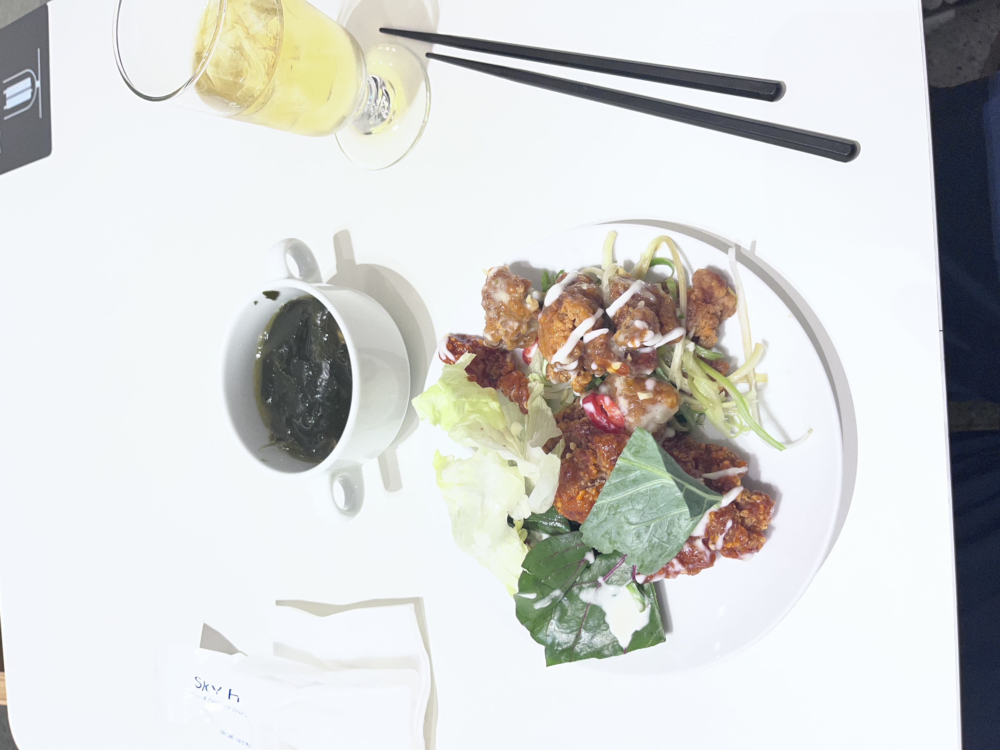

그동안 마티나 라운지만 이용했었는데 이번에 스카이허브 라운지를 처음으로 이용해 보았습니다. 생각보다 음식 종류도 다양했고 편하게 앉아서 쉴 수 있어서 만족스러웠습니다.

배부르게 먹고 면세품도 수령했습니다. 출국 전에 하려고 했던 일을 모두 마치고 나니 이제 정말 비행기에 타는 일만 남았습니다.
장거리 비행이라 출발하기 전까지 최대한 편하게 쉬었습니다.

## 넓은 자리, 그리고 잠들지 못한 비행 🛫

이번에 탄 비행기는 대한항공이었습니다. 출발 전에는 스타링크 와이파이를 쓸 수 있다는 이야기(심지어 보잉 777-300er에 선적용된다는 찌라시..ㅎ)를 듣고 은근히 기대했는데, 아쉽게도 이번 비행에서는 사용할 수 없었습니다.

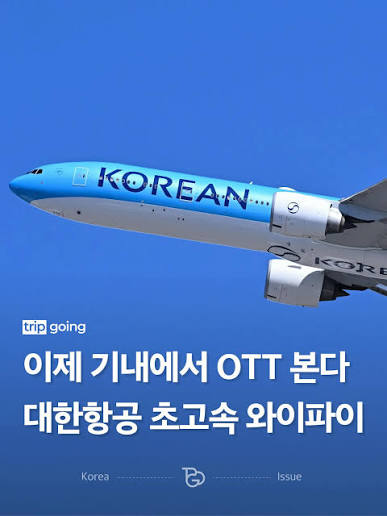

비행 시간이 길다 보니 와이파이가 되면 노트북으로 이것저것 정리하면서 갈 생각도 했었는데, 결국 기내에서 제공하는 영화/다큐를 몰아보는 것으로 만족해야했습니다 ㅎㅎ

대신 뜻밖의 행운이 있었습니다. 조금 편하게 갈 수 있는 자리가 있는지 여쭈어보니, 감사하게도 항공사 직원분이 비상구 자리로 바꿔주셨습니다.

장거리 비행에서 다리를 편하게 뻗을 수 있다는 것만으로도 정말 좋았습니다. 키가 큰 편이라 일반 좌석에서는 오래 앉아 있으면 답답한데, 이번에는 공간이 넓어서 훨씬 편하게 갈 수 있었습니다.

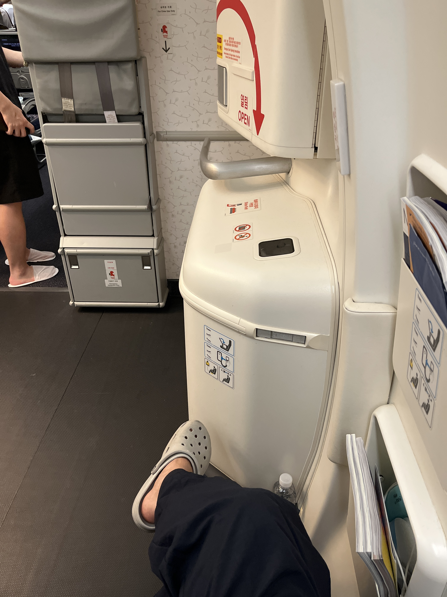

_발을 뻗을 수 있어 정말 감사했습니다._

그리고 탑승 후 1시간, 도착 전 1시간쯤 각각 기내식이 나왔습니다. 대한항공답게 두 번 모두 만족스럽게 먹었습니다. 저는 한식과 양식을 각각 한 번씩 골랐습니다.

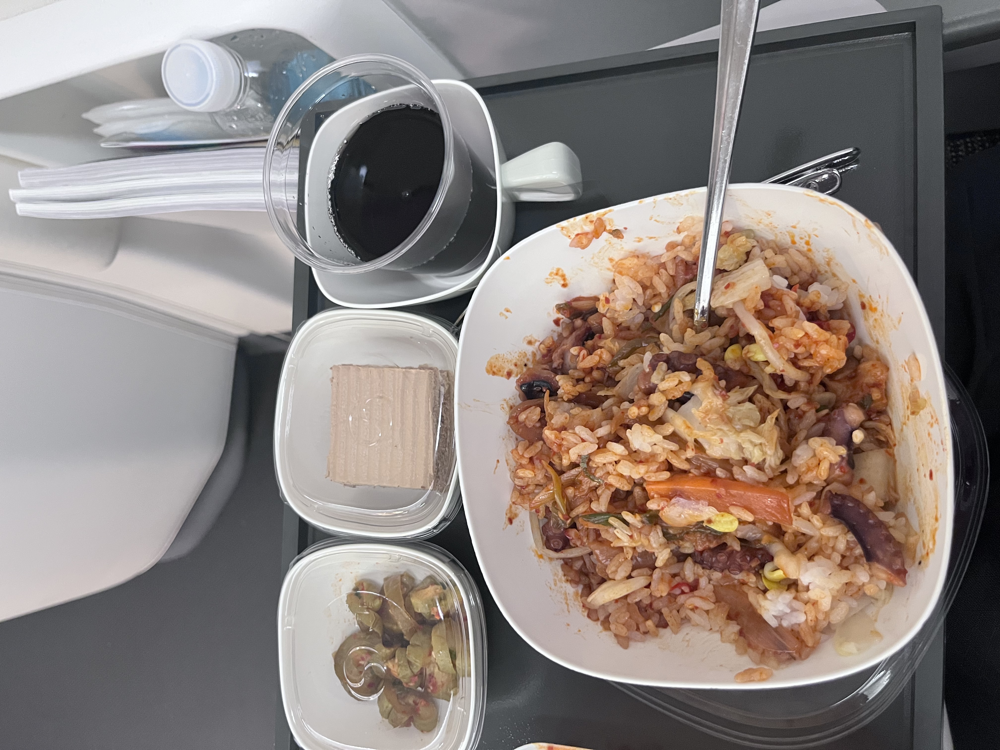
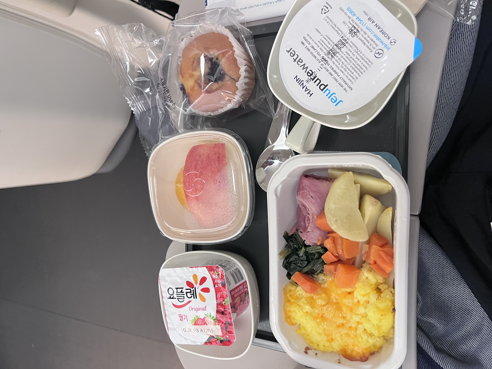

문제는 잠이었습니다.
자리는 편했는데 이상하게 잠이 오지 않았습니다. 도착해서 바로 움직이려면 비행기에서 어느 정도 자두는 게 좋을 것 같았는데, 자려고 해도 계속 잠이 깨서 결국 거의 자지 못했습니다.

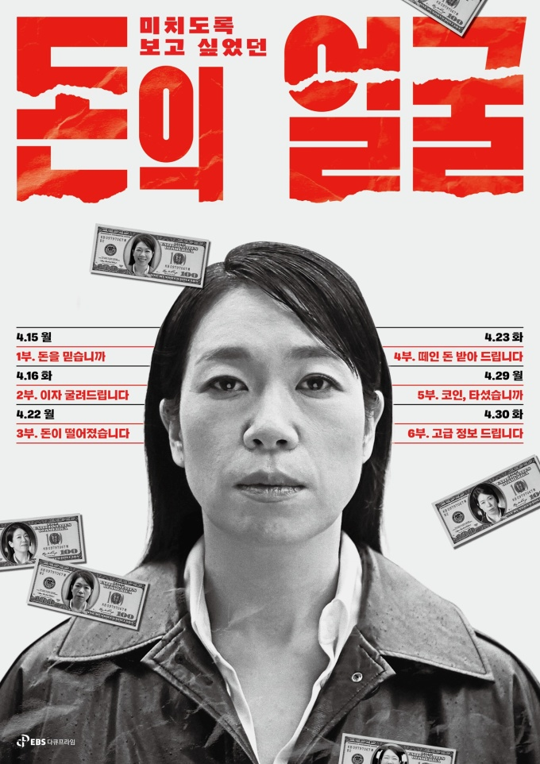

_엄혜란 배우가 출연한 돈의얼굴 (엄청 재미있어요)_

다큐/영화를 보다가 자려고 눈을 감고, 다시 깨서 시간을 확인하는 걸 계속 반복했습니다. 비상구 좌석 덕분에 몸은 편했지만 잠까지 해결해주지는 못했습니다. 😅

그렇게 약 12시간의 비행 끝에 라스베이거스에 무사히 도착했습니다!

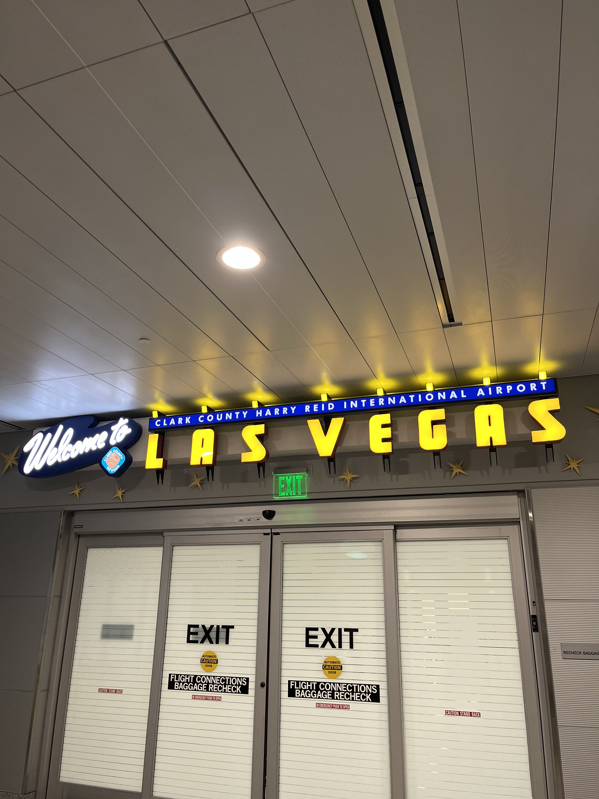
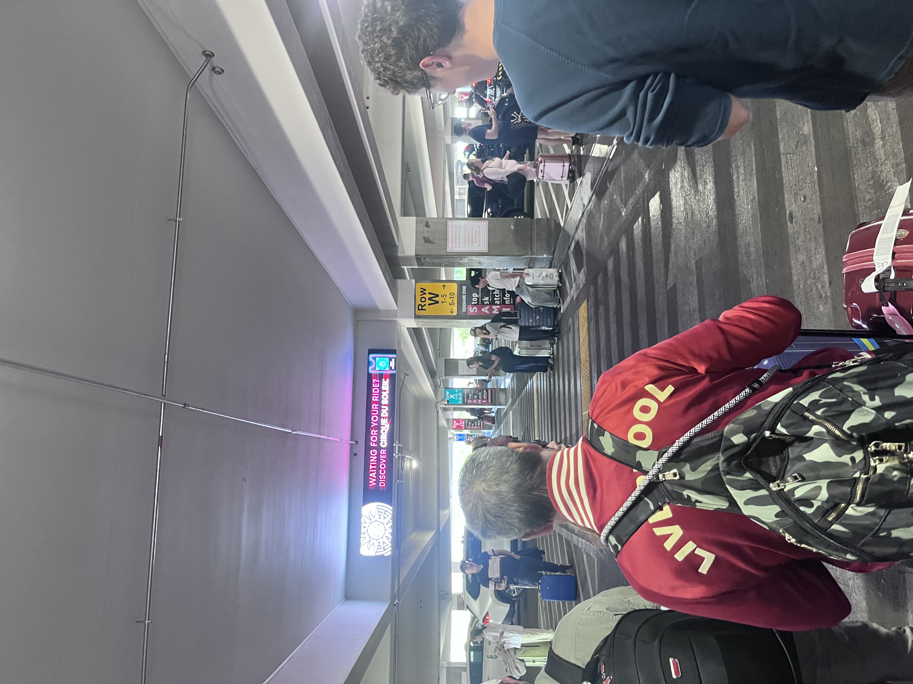

_긴 비행 끝에 도착한 해리 리드 공항에서 우버를 기다렸습니다._

몸은 라스베이거스에 도착했는데 잠을 거의 못 자서 정신은 꽤 몽롱했습니다. 그래도 공항 밖으로 나오니 라스베이거스 특유의 덥고 건조한 날씨가 바로 느껴졌습니다.
입국 수속과 짐 찾기까지 마치고 우버를 불러 호텔로 이동했습니다.

## 코스모폴리탄 체크인과 20달러 🏨

이번 숙소는 dbt Summit이 열리는 **코스모폴리탄 호텔**이었습니다. 숙소와 행사 베뉴가 같은 곳이라는 점이 가장 마음에 들었습니다.
며칠 동안 아침부터 세션을 들어야 하는 일정이라 다른 호텔에서 매일 이동해야 했다면 꽤 번거로웠을 텐데, 엘리베이터를 타고 내려가면 바로 컨퍼런스장이라는 점이 정말 편했습니다.

회사에서는 기본적으로 시티뷰 객실을 지원해줬는데, 막상 체크인하려니 조금 더 좋은 전망의 방을 받을 수 있을지 궁금해졌습니다.

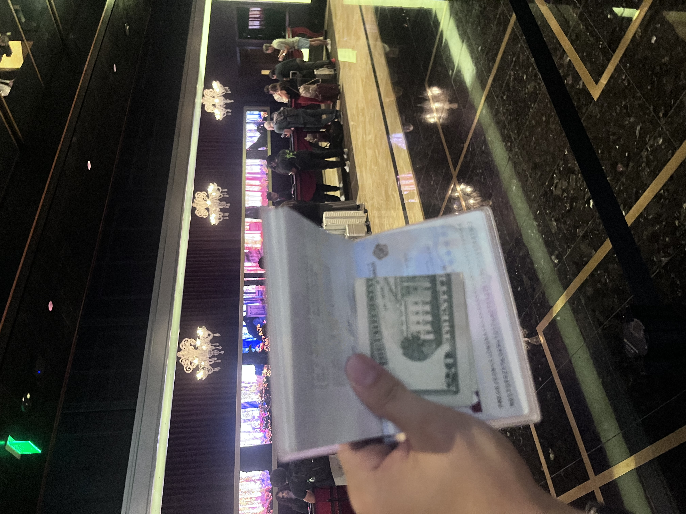
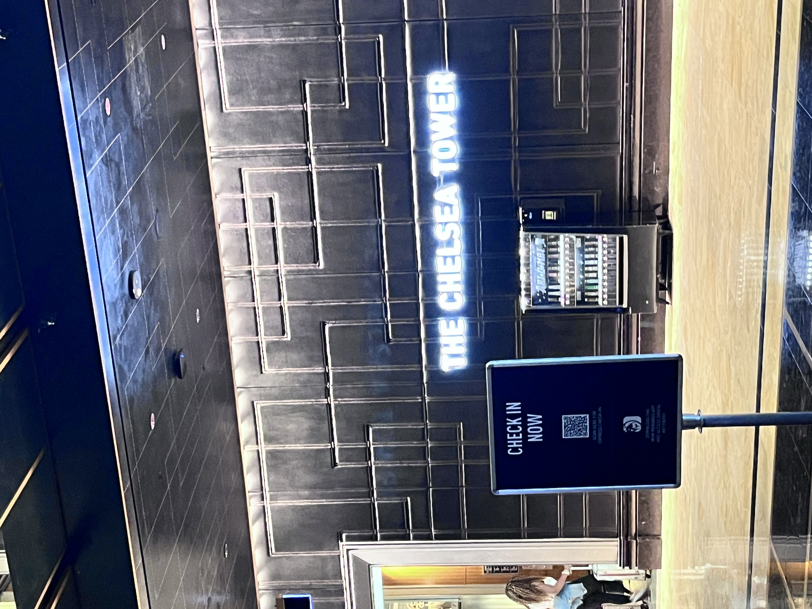

여러 블로그 후기를 보니, 일종의 팁을 데스크 직원에게 드리면 높은 확률로 가능하다는 소식을 듣고, 일명 20달러 트릭을 한번 해보기로 했습니다.
여권에 20달러를 넣고 더 좋은 뷰의 방으로 업그레이드가 가능한지 물어봤습니다. 처음 해보는 거라 조금 어색하긴 했는데, 다행히 직원분이 흔쾌히 가능하다고 해주셨습니다.

결과적으로 뷰가 좋은 고층의 첼시 타워 객실을 받을 수 있었습니다. 😎

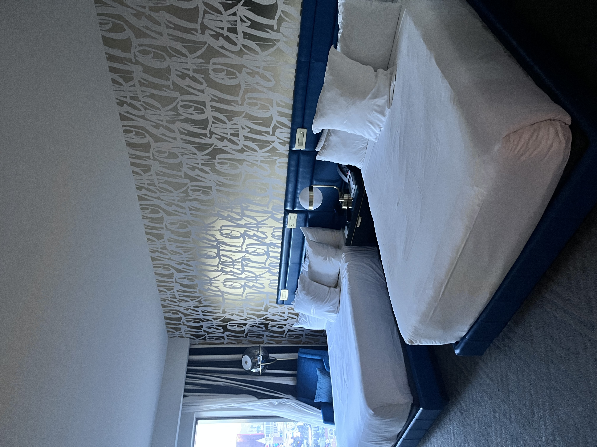

_짐을 풀고 잠시 숨을 돌린 코스모폴리탄 객실._

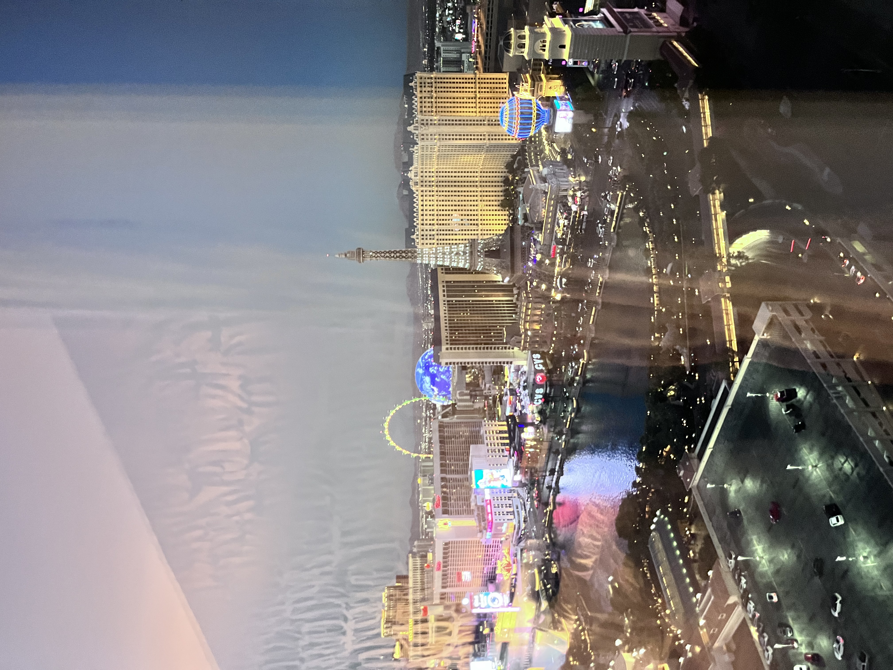

_창밖으로 펼쳐진 라스베이거스 풍경._

방도 넓었고 무엇보다 뷰가 마음에 들었습니다. 높은 층에서 스트립 주변과 스피어를 내려다볼 수 있어서 20달러를 써본 보람이 있었습니다.

숙소에 짐을 풀고 샤워를 했습니다. 비행기에서 제대로 못 잤기 때문에 그냥 누워서 자고 싶기도 했지만, 아직 시간이 남아 있어서 잠깐 밖으로 나가보기로 했습니다.
호텔에서 나오자마자 바로 스트립이라 별다른 계획 없이 걷기에도 좋았습니다.

## 다시 걷는 라스베이거스 스트립 🌃

라스베이거스는 올해 5월에 아내와 함께 방문한 적이 있습니다. 다만 그때는 LA에서 그랜드캐년으로 가는 길에 들르는 일정에 가까워서 도시 자체를 오래 둘러보지는 못했습니다.

몇 달 만에 같은 곳을 이번에는 여행이 아니라 출장으로 다시 오게 된 것도 조금 신기했습니다. 지난번에는 아내와 여행으로 왔던 곳을 이번에는 혼자 컨퍼런스를 위해 걷고 있으니 느낌도 꽤 달랐습니다.

첫날은 따로 일정을 잡지 않고 스트립을 걸으면서 주변을 둘러봤습니다.

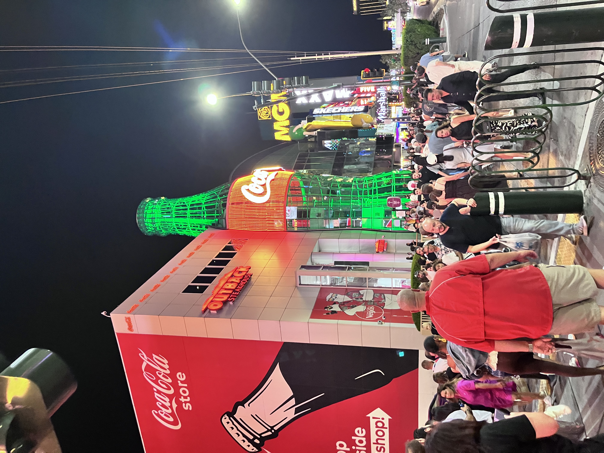

_코카콜라 스토어 앞. 거리를 걷는 것만으로도 볼거리가 이어졌습니다._

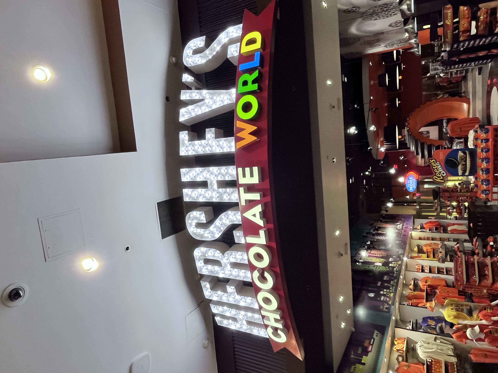
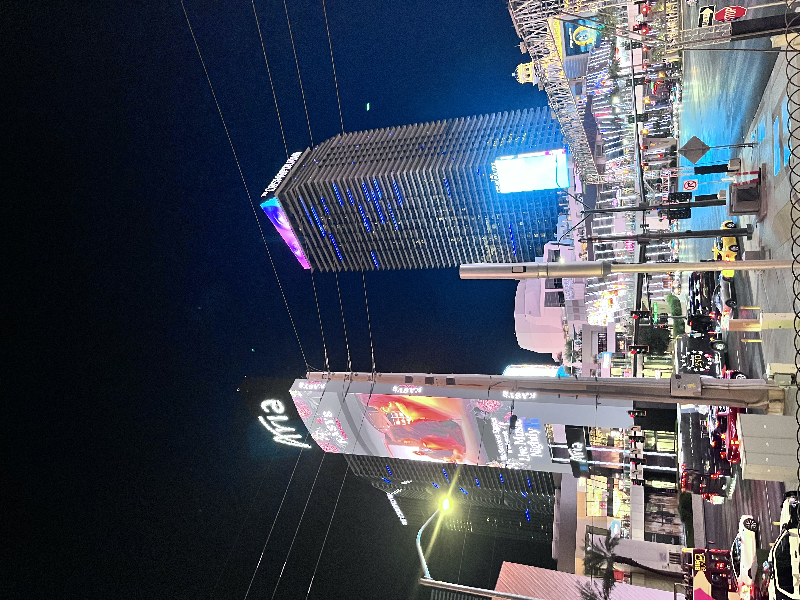

코카콜라 스토어, 허쉬, M&M's 스토어를 둘러보고 CVS에도 들렀습니다.
익숙한 브랜드들이지만 라스베이거스에서는 매장 규모도 크고 간판도 화려해서 구경하는 재미가 있었습니다. 라스베이거스는 역시 그냥 스트립을 걷는 것만으로도 볼거리가 많았습니다. (미국 물가는 너무 비싸네요)

몇 달 전에 왔던 곳인데도 밤에 다시 걸어보니 또 다른 느낌이었습니다. 별다른 목적지 없이 이곳저곳 둘러보면서 걷다 보니 어느새 시간이 꽤 지나 있었습니다.

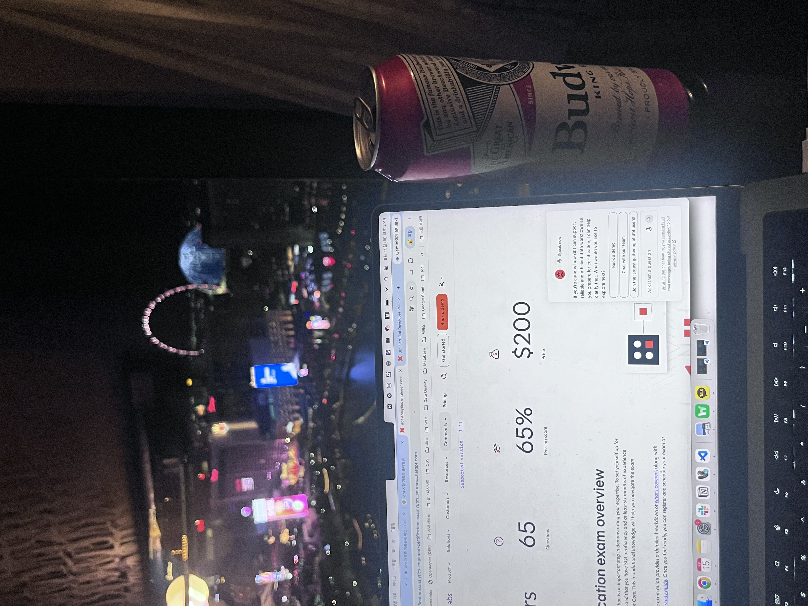

공항에서 일찍 시작한 하루가 긴 비행과 호텔 체크인, 스트립 산책까지 이어졌습니다.

비행기에서 거의 잠을 못 잔 데다 시차 적응도 되지 않아 슬슬 체력이 떨어지기 시작했습니다. 더 돌아다니고 싶은 마음도 있었지만 다음날부터 컨퍼런스 일정이 시작되기 때문에 첫날은 여기까지만 둘러보고 호텔로 돌아왔습니다.

숙소에 돌아와 다음날 들을 세션들을 다시 한번 확인하고 잠을 청했습니다.

---

다음날부터는 본격적인 dbt Summit 일정이 시작됩니다.
이번 컨퍼런스에서는 dbt의 새로운 기능도 궁금했지만, 다른 회사들이 **Semantic Layer, AI Agent, 데이터 거버넌스, Analytics Engineering**을 실제로 어떻게 적용하고 있는지가 가장 궁금했습니다.

또 국내에서는 접하기 어려웠던 사례들을 직접 듣고, 현재 업무에 적용할 수 있는 아이디어도 찾아보고 싶었습니다.

실제로 컨퍼런스가 시작되고 나니 업무와 연결해서 생각해 볼 만한 내용이 꽤 많았습니다. 세션뿐만 아니라 행사장 구성과 부스에서 느낀 점, 다른 참가자들과 나눈 이야기도 있었습니다.

그 내용은 다음 글부터 하나씩 정리해 보겠습니다. 👋

---

**dbt Summit 2026 출장 기록**

1. **출국/도착 — 현재 글**
2. DBT 컨퍼런스 1일차 — 작성 예정
3. DBT 컨퍼런스 2일차 — 작성 예정
4. DBT 컨퍼런스 3일차 — 작성 예정
5. DBT 컨퍼런스 4일차 — 작성 예정
6. 한국 복귀와 느낀 점 — 작성 예정
