둘째 날부터는 본격적인 컨퍼런스 일정이 시작되었습니다. 전날이 등록과 파트너 부스, 오리엔테이션에 가까웠다면, 이날은 아침 9시 키노트부터 각자 선택한 세션을 듣는 날이었습니다.

저도 아침부터 꽤 분주하게 움직였습니다. 키노트 세션은 호텔 안의 대극장에서 시작되었고, 이후에는 Semantic Layer, 데이터 커리어 라운드테이블, dbt Semantic Layer hands-on, Agent Context 관련 세션을 이어서 들었습니다.

## 09시 Keynote, 본격적인 시작 🎮

아침 9시 키노트를 듣기 위해 대극장으로 이동했습니다.
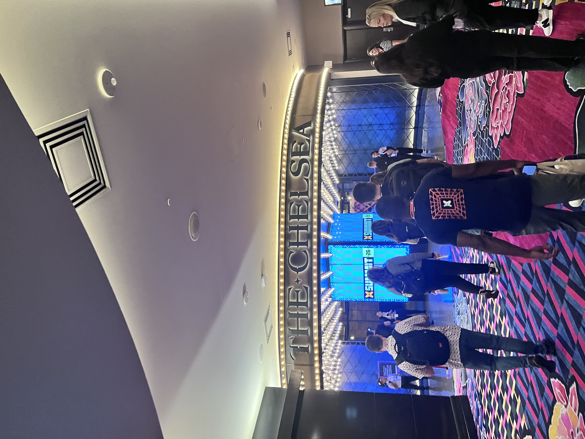
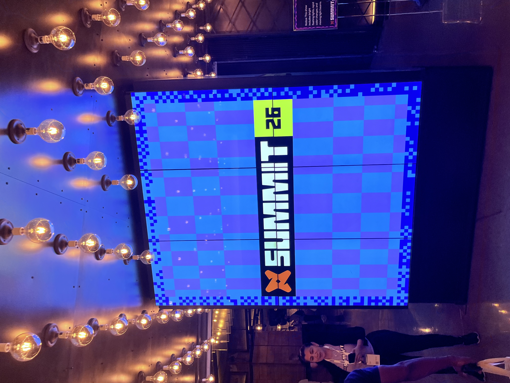

전날에도 사람이 많다고 느꼈는데, 키노트가 시작되는 둘째 날 아침에는 확실히 행사장 분위기가 달랐습니다. 이렇게 많은 사람들이 컨퍼런스에 참석했구나 싶더라구요.

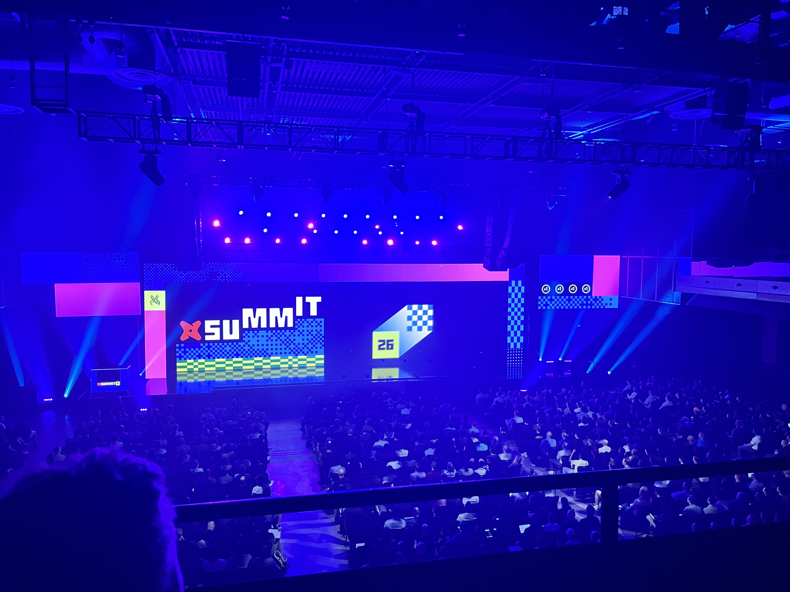

_키노트가 시작되기 전, 대극장 입구부터 이미 사람들이 꽤 많이 모여 있었습니다._

행사장 안으로 들어가니 조명과 무대 연출이 생각보다 엄청 났습니다 ㅎㅎ 이번 컨퍼런스에 23개국(한국인 저 포함..?)에서 온 약 2,000명의 현장 참가자와 전 세계 온라인 참가자들이 함께한다고 소개했습니다.

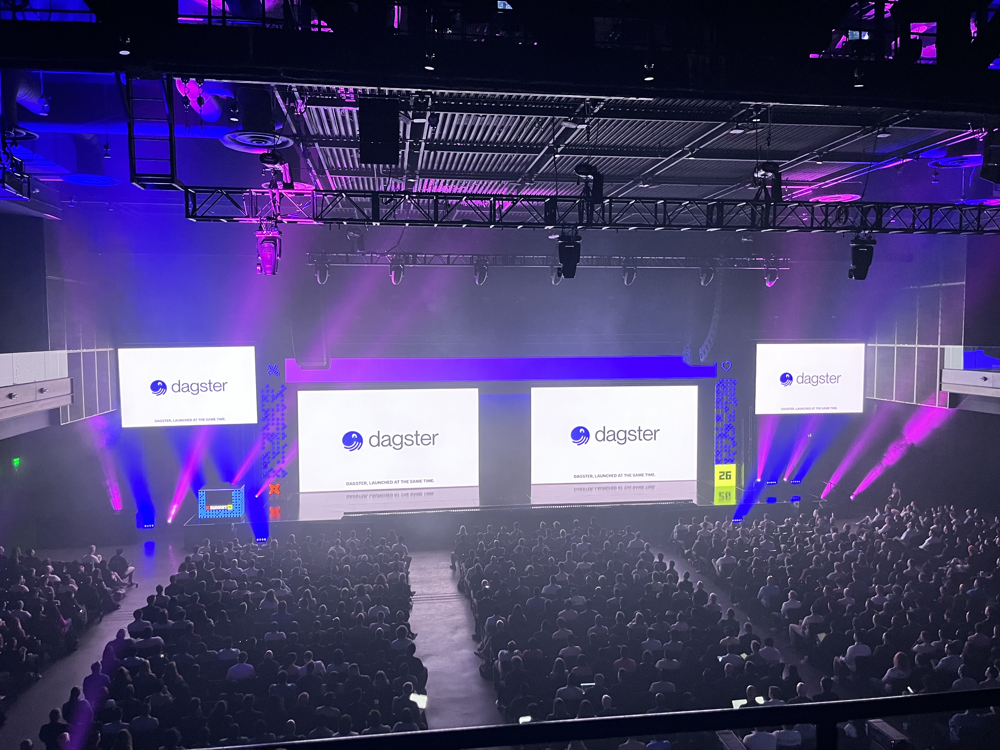
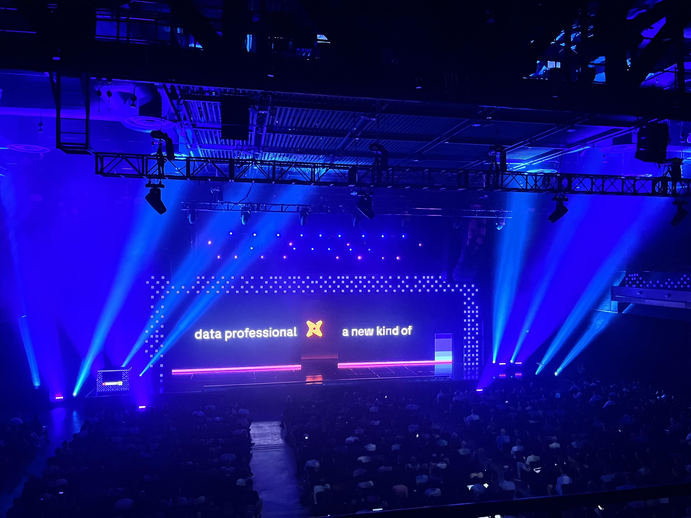

_웅장한 분위기 였습니다_

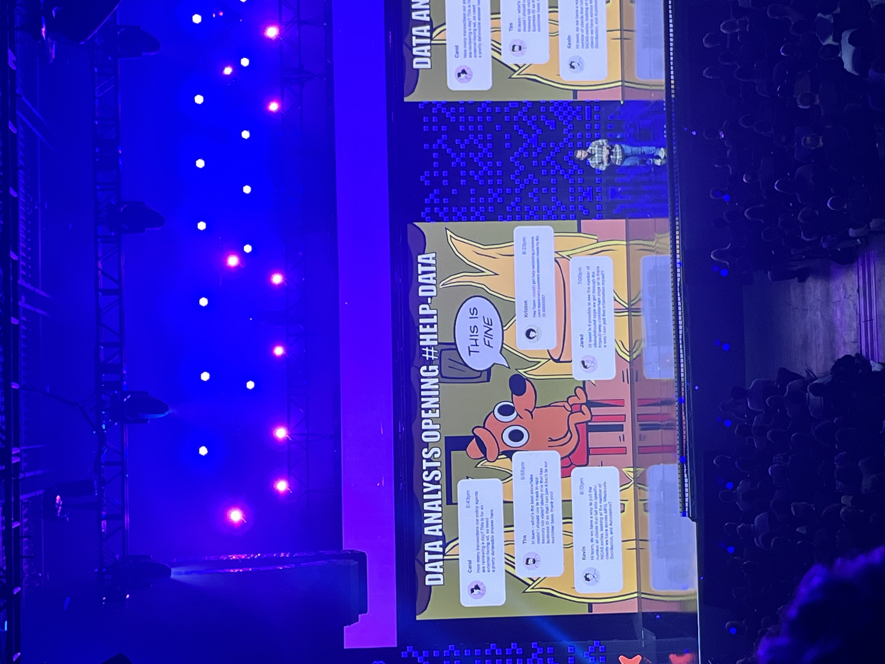

- 역시나 키노트에서 가장 많이 등장한 키워드는 AI였습니다. AI Agent가 단순히 코드를 작성하는 수준을 넘어, 파이프라인 오류를 찾고 레거시 코드를 리팩터링하고, 지표와 테이블, 메타데이터까지 직접 사용하는 주체가 될 것이라는 이야기였습니다. AI 이야기가 많이 나올 거라고 예상은 했지만, 생각했던 것보다 거의 모든 발표가 AI와 연결되어 있었습니다.

- 키노트 이후 공유된 CEO의 핵심도 비슷했습니다. Open Data Infrastructure, AI integrations, Lake Compute on dbt 같은 여러 발표가 있었지만, 그중에서도 특히 신규 피처인 dbt v2 GA가 강조되었습니다. 새 엔진은 이미 9,000개 이상의 팀에서 사용 중이며, 이제 더 많은 팀이 본격적으로 도입할 수 있는 단계로 소개되었습니다.

- 추후 공식 발표 글에서도 dbt v2는 "하나의 dbt, 하나의 엔진"이라는 방향으로 정리되어 있었습니다. 기존에 **dbt Fusion engine**이라고 부르던 새 엔진은 이제 그냥 **dbt**가 되었고, **dbt Core v2**는 **dbt OSS**라는 이름으로 정리되었습니다. 이름은 바뀌었지만, 6월 발표 이후의 라이선스 방향이나 코드 공개 범위가 달라진 것은 아니라고 설명했습니다. 자세한 내용은 [dbt Summit 2026 제품 발표 정리](https://www.getdbt.com/blog/dbt-summit-2026-product-announcements)와 [dbt와 dbt OSS 비교 글](https://docs.getdbt.com/blog/comparing-dbt-and-dbt-oss)에 정리되어 있습니다.

- 이 변화가 크게 느껴졌던 이유는 dbt가 단순히 기능을 추가하는 수준이 아니라, 앞으로의 기본 실행 엔진을 바꾸는 발표였기 때문입니다. dbt v2는 Rust 기반의 새 엔진을 중심으로 로컬 개발과 dbt platform 양쪽에서 더 빠른 개발 경험을 제공하는 방향으로 소개되었습니다.

- 실제로 모델 수가 많아지면서 compile이나 build 시간이 꽤 신경 쓰일 수 있는 부분일텐데, 실제로 얼마나 빨라질지는 한번 써보고 싶다는 생각이 들었습니다.

- 그리고 여기서부터 조금씩 이번 Summit에서 계속 이야기하는 방향이 보이기 시작했습니다.
AI Agent가 데이터를 직접 사용하려면 단순히 테이블만 잘 만들어놓는 것으로는 부족하고, 이 데이터가 무엇인지, 어떤 지표를 써야 하는지, 데이터 간에는 어떤 관계가 있는지 같은 맥락까지 같이 제공해야 한다​는 이야기였습니다.

- 이후에 들었던 Semantic Layer나 Context 관련 세션들도 대부분 이 주제와 연결되어 있었습니다.

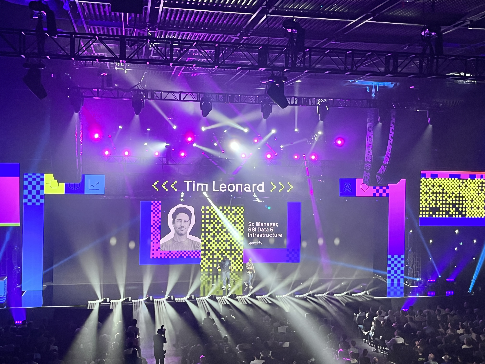

- 키노트에서는 제품 발표도 꽤 많이 이어졌습니다. 아래 사진에 남긴 것처럼 **Lake Compute**, **dbt Charts**, **dbt Wizard**가 차례로 소개되었습니다.

- 실제 현업 사례를 실무자가 발표하고, DBT Labs의 엔지니어들이 어떤 맥락에서 이걸 개발하고 어떤 업사이드가 있었는지 공유하는 방식으로 세션이 진행되었습니다.

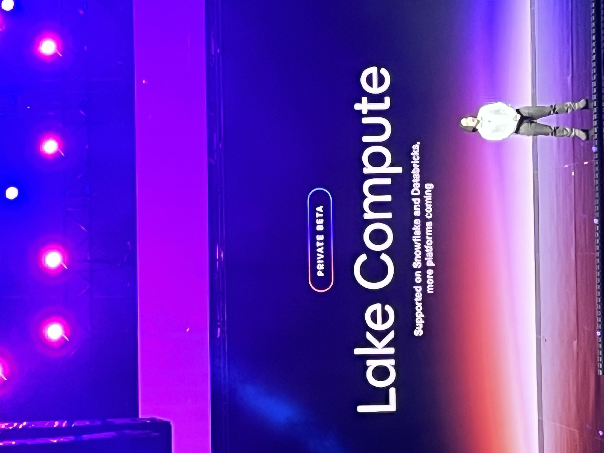

- [Lake Compute](https://docs.getdbt.com/docs/lake-compute?version=2)는 Apache Iceberg 테이블을 중심으로, 모든 모델을 하나의 웨어하우스에서 처리하는 대신 모델별로 적절한 실행 엔진을 선택할 수 있게 하려는 방향으로 설명되었습니다. 공식 발표 글에서는 DuckDB 기반의 Serverless Compute Engine으로 소개되었고, 필요한 모델만 Lake Compute에서 실행하고 나머지는 기존 웨어하우스에서 계속 실행할 수 있다는 점이 강조되었습니다.

- 개인적으로 Lake Compute는 조금 의외였습니다. 제가 생각하던 dbt는 Snowflake, Databricks, BigQuery 같은 데이터 플랫폼 위에서 Transformation을 수행하는 역할에 가까웠기 때문입니다. 그런데 이제는 "모든 모델을 굳이 같은 Warehouse Compute에서 실행해야 하나?"​라는 영역까지 dbt가 들어오고 있다는 느낌이었습니다. 작은 작업은 상대적으로 가벼운 Compute에서 처리하고, 큰 작업만 기존 Warehouse에서 처리할 수 있다면 비용 측면에서도 꽤 재미있는 선택지가 될 것 같습니다.

- 특히 사례에서 보여준 Iceberg처럼 Storage와 Compute가 점점 분리되는 구조를 생각하면 앞으로 어떻게 발전할지 개인적으로 궁금했던 기능입니다. (비교적 가벼운 Transformation은 Lake Compute에서 처리하고 대규모 연산은 기존 Warehouse에서 처리하는 식의 워크플로우가 생기지 않을까요..?)

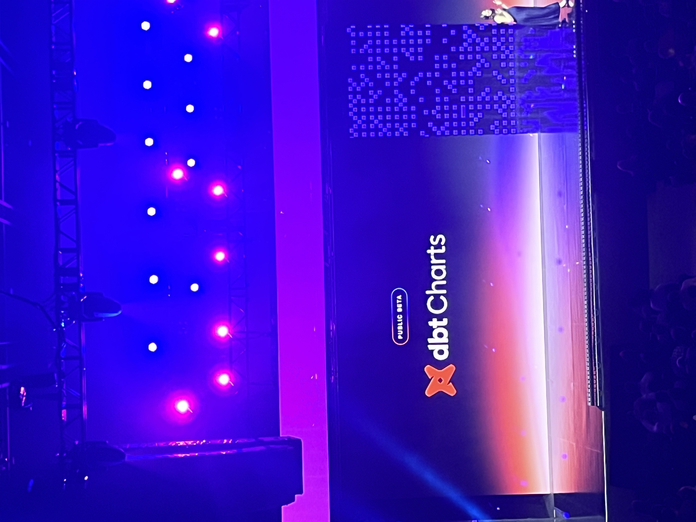
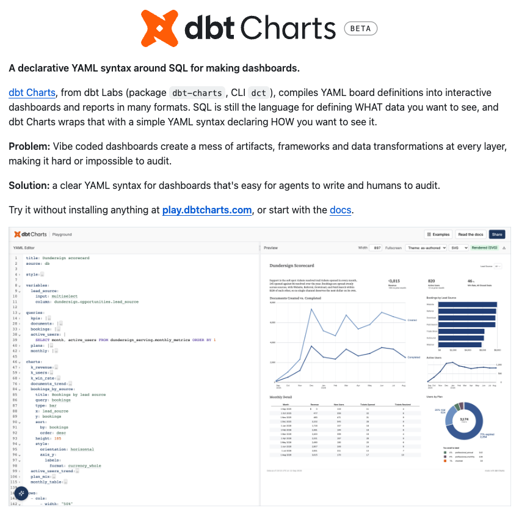

- [dbt Charts](https://github.com/dbt-labs/dbt-charts)는 대시보드를 코드로 관리하려는 시도에 가까웠습니다. SQL 모델은 이미 Git과 PR, CI 위에서 관리하는데, 마지막 결과물인 대시보드는 여전히 BI 도구 안에 갇혀 있는 경우가 많습니다. dbt Charts는 YAML로 대시보드를 정의하고, 모델과 같은 저장소와 리뷰 흐름 안에서 관리하려는 방향으로 소개되었습니다.
- dashboard as a code와 같은 맥락이라고 봐도 될 것 같습니다. 다만 여기서 제공하는 function이 직관적이거나, 궂이 DBT 프로젝트에 정의해야될 차별점이 있는지는 잘 모르겠습니다 ㅎㅎ

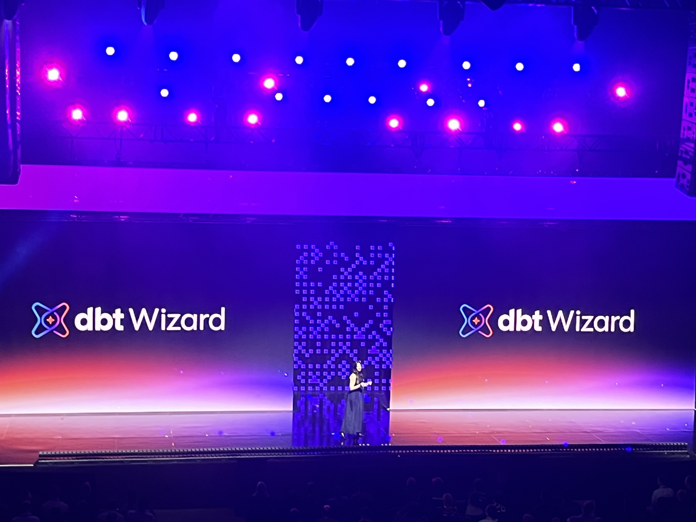

- [dbt Wizard](https://www.getdbt.com/product/dbt-wizard)는 analytics engineering을 위한 AI Agent로 소개되었습니다. 프로젝트 구조와 lineage, test 결과를 바탕으로 변경 영향을 확인하고, 변경 사항을 build와 compile까지 검증하는 방향이었습니다. 키노트 전체가 "AI가 데이터를 쓰는 시대"를 이야기했다면, Wizard는 그 흐름을 dbt 개발 경험 안으로 가져오는 제품처럼 보였습니다.

- 다만, 개인적으로는 이미 숙련된 수준으로 claude를 활용하고 있거나, claude에 여러가지 dbt artifact(catalog.json, manifest.json)을 표준화된 컨텍스트(e.g skill)로 활용하고 있는 경우 당장 써야할 이유를 찾지는 못했습니다ㅠ (써야할 더 좋은 이유가 있다면 알려주세요.)

키노트 전체를 듣고 나니 이번 dbt Summit에서 dbt가 가려는 방향이 꽤 명확하게 느껴졌습니다.

| 영역            | 주요 발표                             | 핵심 내용                                                                       |
| ------------- | --------------------------------- | --------------------------------------------------------------------------- |
| Engine        | **dbt v2**                        | Rust 기반의 새로운 엔진을 통해 개발 및 실행 성능 개선                                           |
| Efficiency    | **dbt State**                     | 변경된 모델을 판단해 불필요한 실행과 Warehouse Compute 절감                                   |
| Compute       | **Lake Compute**                  | Iceberg 기반으로 모델별 적절한 Compute Engine 선택                                      |
| Context       | **Semantic Layer / Agent Schema** | Metric·Metadata·Lineage·Usage 등의 Context를 구조화해 AI Agent가 신뢰할 수 있는 데이터 정의 제공 |
| AI            | **dbt MCP / dbt Wizard**          | dbt Context를 Agent에 연결하고 개발·분석 업무를 AI로 지원                                   |
| Visualization | **dbt Charts**                    | Dashboard까지 코드와 Git 기반으로 관리                                                 |

개인적으로는 dbt가 기존 Transformation 중심에서 **Compute → Semantic Layer → Agent Context → AI Agent → Visualization까지 영역을 넓히고 있다는 점**이 가장 인상적이었습니다.

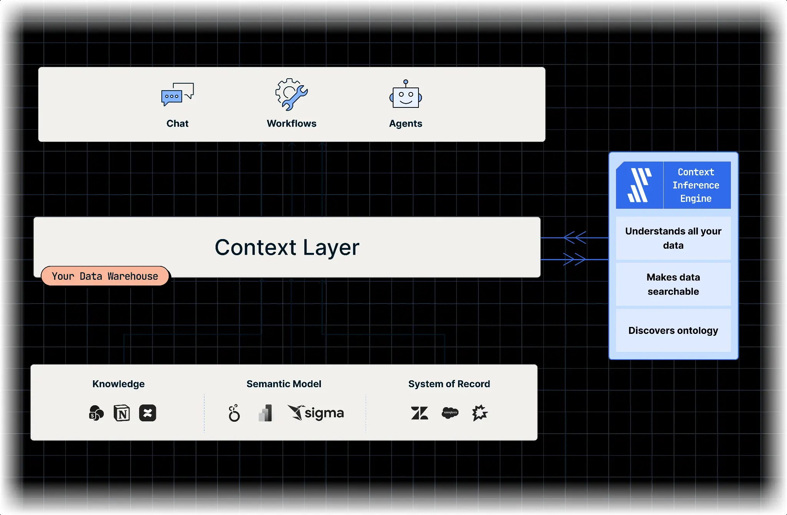

또한 뒤이은 세션에서도 언급되는 "에이전트 스키마"에 대한 내용도 많이 언급이 되었는데요.

Agents Schema는 Data Lineage, 문서, Owner 등의 Context까지 모아 AI Agent가 SQL로 직접 조회할 수 있게 만든 Schema라고 합니다. (실제 Warehouse/Lake의 일반 SQL 테이블로 저장한다고 하네요.)

즉, Semantic Layer가 의미를 정의하는 곳이라면 Agents Schema는 그 의미를 Agent가 쉽게 발견하고 사용할 수 있도록 표준화해 전달하는 인터페이스에 가깝다고 이해했습니다.

관심이 있으신 분은 아래 오픈소스 확인해보시면 도움이 많이 될 것 같습니다 :)
- https://github.com/dbt-labs/agents_schema

---

## Semantic Layer is Dead. Long Live the Semantic Layer

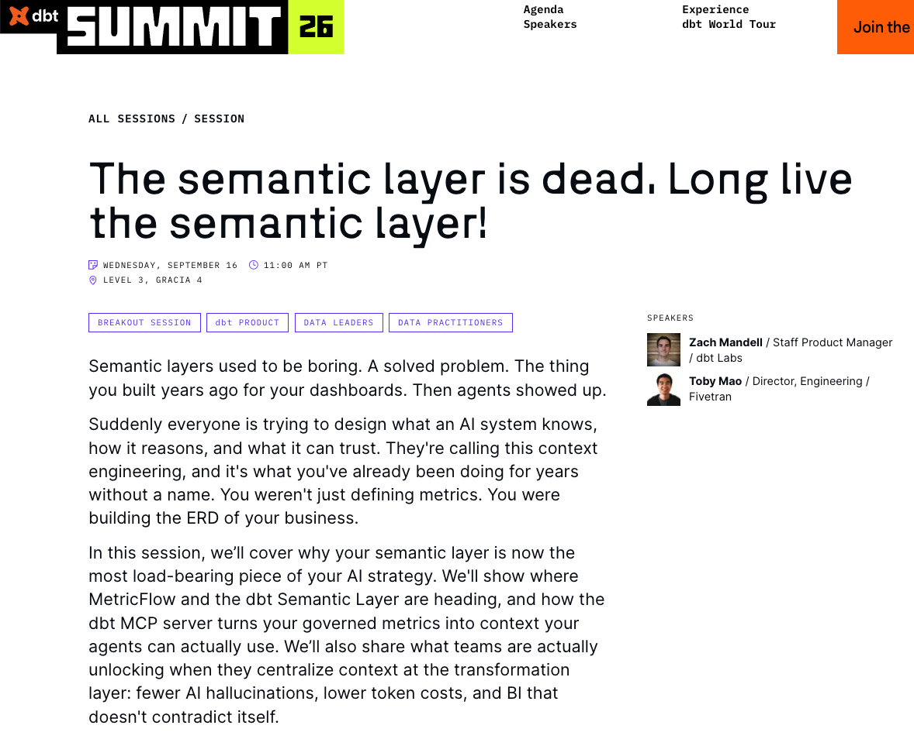

첫 번째로 선택한 세션은 **Semantic Layer is Dead. Long Live the Semantic Layer**였습니다. 제목부터 어그로가 강했습니다. Semantic Layer가 죽었다고 말하면서도, 다시 Semantic Layer가 살아남아야 한다고 말하는 구성(?)이었습니다 ㅎㅎ

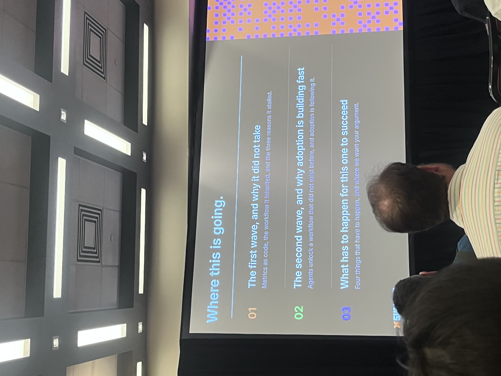
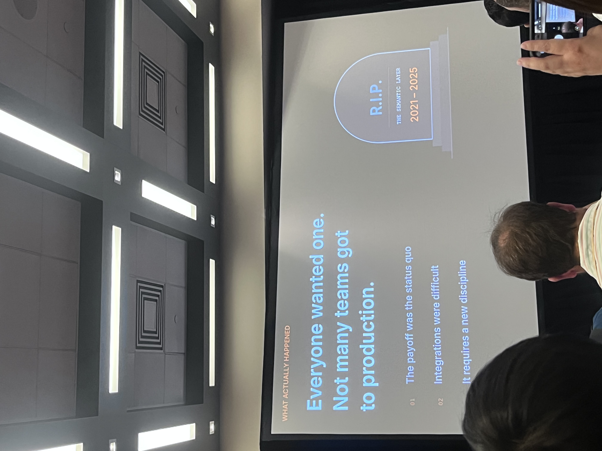

- 이 세션은 Semantic Layer의 첫 번째 물결과 두 번째 물결을 나누어 설명했습니다.

- 첫 번째 물결은 지표를 코드로 정의하고, 중앙 저장소에서 정의한 지표를 여러 도구에 제공하는 방식에 가까웠습니다. 이 접근은 분석가들이 각 BI 도구에서 같은 지표를 반복해서 계산하던 문제를 해결하려는 시도였습니다. 지표를 한곳에서 정의하고, 여러 소비 도구가 그 정의를 가져다 쓰게 만들자는 생각이었습니다. (Single Source Of Truth 관점으로 보입니다.)

- 하지만 발표에서는 이 방식이 현장에서 충분히 성공하지 못했다고 설명했습니다. 비즈니스 사용자 입장에서는 여전히 기존 BI 도구에 들어가 같은 숫자를 확인하는 경험에 가까웠고, Semantic Layer를 도입했다고 해서 즉시 체감할 만한 추가 가치가 생기지는 않았습니다.

- 슬라이드의 "Everyone wanted one, but many teams got no production"이라는 문장이 이 문제를 잘 보여주었습니다. 모두가 Semantic Layer를 원했지만, 실제 운영 환경까지 안정적으로 가져간 팀은 많지 않았다는 의미였습니다.

- 또 다른 문제는 통합이었습니다. 도구마다 Semantic을 정의하는 방식이 달랐고, BI 도구와 AI 도구도 각자 자체적인 Semantic 체계를 가지고 있었습니다. 이런 상황에서는 외부에서 정의한 Semantic Layer를 모든 도구가 자연스럽게 받아들이도록 만드는 일이 쉽지 않았습니다.

- (그래서 [OSSIE](https://ossie.apache.org/)처럼 표준화된 Semantic 체계가 등장하는 흐름도 자연스럽게 이해되었습니다.)

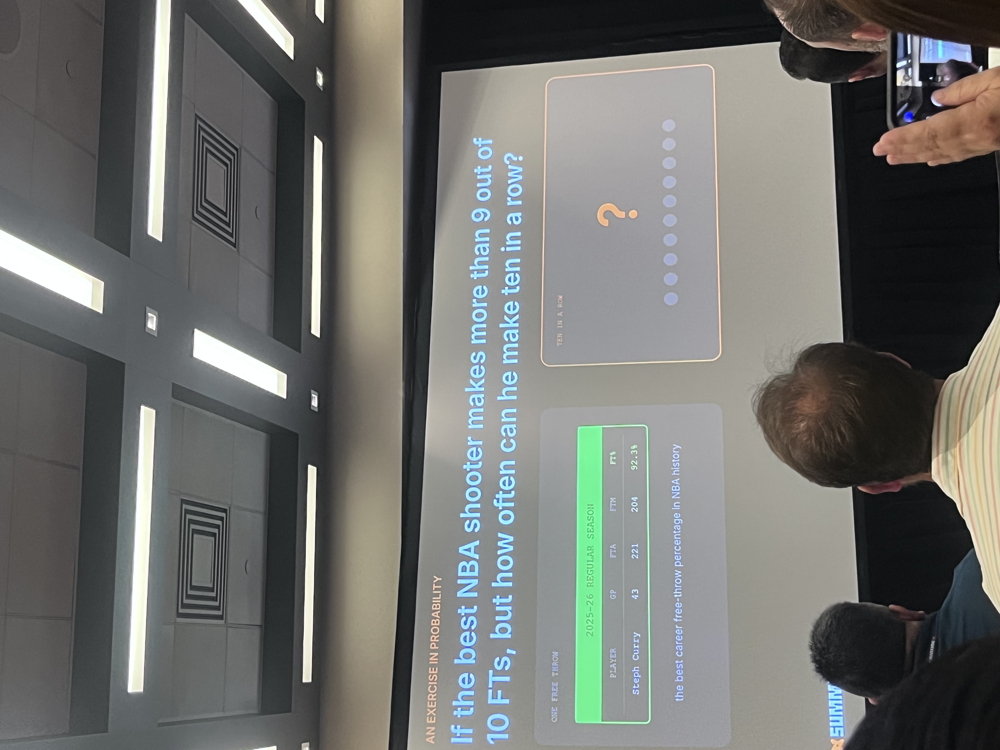
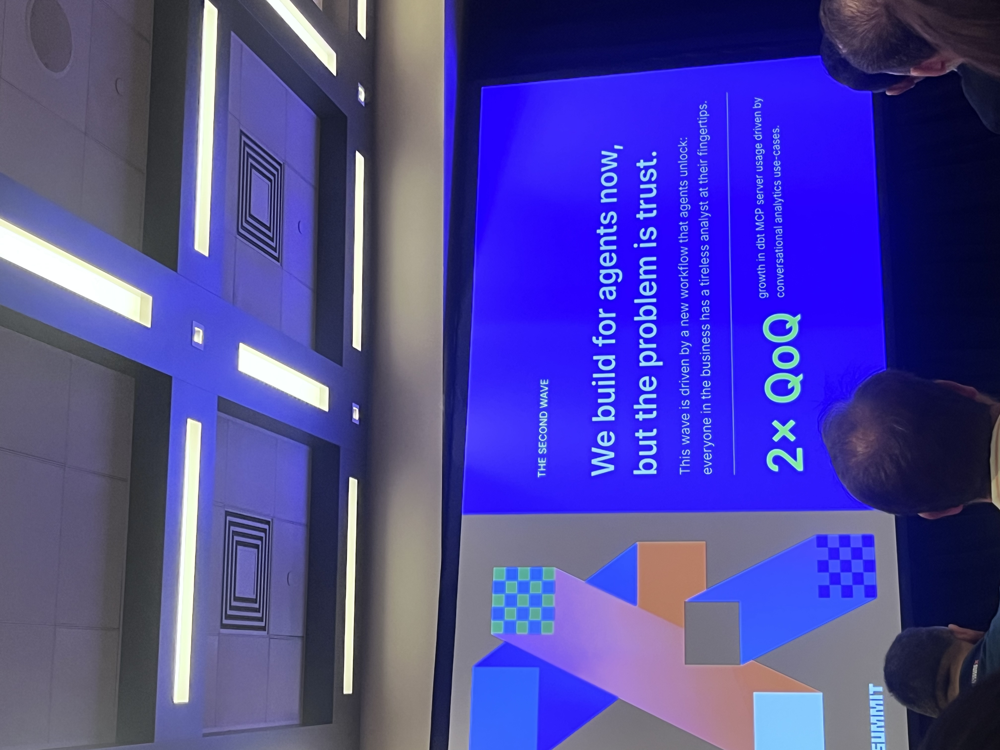

- 그런데 AI Agent가 등장하면서 이야기가 조금 달라집니다. 사람이 직접 BI를 볼 때는 어떤 테이블을 봐야 하는지, 어떤 컬럼을 사용해야 하는지 어느 정도 알고 있습니다. 반면 Agent는 이것부터 스스로 판단해야 합니다.

- 발표에서는 Semantic Layer 사용량이 분기마다 두 배씩 증가한다는 흐름이 소개되었습니다. 대화형 분석과 AI Agent 활용이 늘어나면서 Semantic Layer가 다시 주목받고 있다는 이야기였습니다.

- 다만 두 번째 물결에서 가장 중요한 문제는 **신뢰**였습니다.

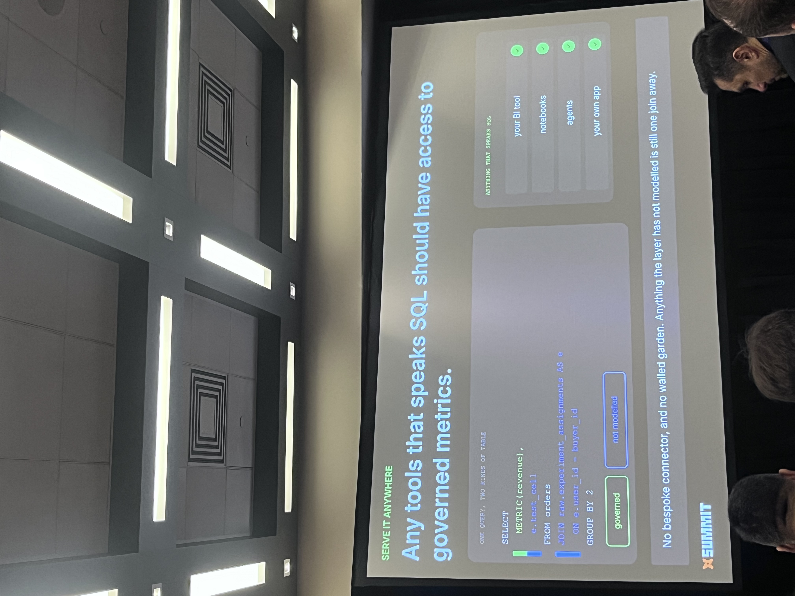
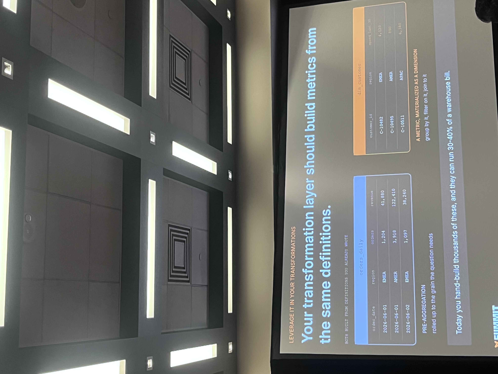

- 예를 들어 Agent에게 "지난달 한국 매출 알려줘"​라고 물어보면 생각보다 많은 판단이 필요합니다.
  - 매출은 어떤 Metric인가?
  - 어떤 테이블을 사용해야 하는가?
  -  한국은 어떤 컬럼으로 판단하는가?
  -  주문일과 결제일 중 어떤 날짜를 사용하는가?
  - 취소와 환불은 어떻게 처리하는가?

- SQL 문법 자체는 맞더라도 여기서 하나만 잘못 선택하면 결과는 틀릴 수 있습니다. 발표에서 말한 두 번째 Semantic Layer는 이 문제를 해결하기 위한 계층에 더 가까웠습니다. 단순히 지표를 한곳에 모아두는 것이 아니라, Agent가 데이터의 의미와 관계를 이해하도록 만드는 기반이라는 의미였습니다.

- 이어진 슬라이드에서는 이 과정을 단계별로 보여주었습니다. Agent는 질문을 받으면 적절한 테이블을 찾고, 필요한 컬럼을 고르고, 집계 표현식을 만들고, 조건을 조합해야 합니다. 단계마다 성공 확률이 높더라도, 여러 단계가 이어지면 전체 신뢰도는 쉽게 낮아질 수 있습니다.

- 예전의 Semantic Layer가 모든 지표를 중앙에서 정의한 뒤 BI 도구에 전달하는 계층이었다면, 지금은 AI Agent가 비즈니스 엔티티와 지표, 관계, 접근 조건을 이해할 수 있게 해주는 컨텍스트 계층에 가깝습니다.

- 특히 발표에서는 Semantic Layer가 비즈니스의 핵심 엔티티를 정의하고, 그 엔티티 간의 관계를 설명해야 한다는 점이 중요하게 다뤄졌습니다. 고객, 주문, 매출, 제품 같은 개념이 단순한 테이블 이름이 아니라 비즈니스를 구성하는 객체로 정리되어야 Agent가 그 위에서 더 복잡한 작업을 수행할 수 있다는 이야기였습니다.

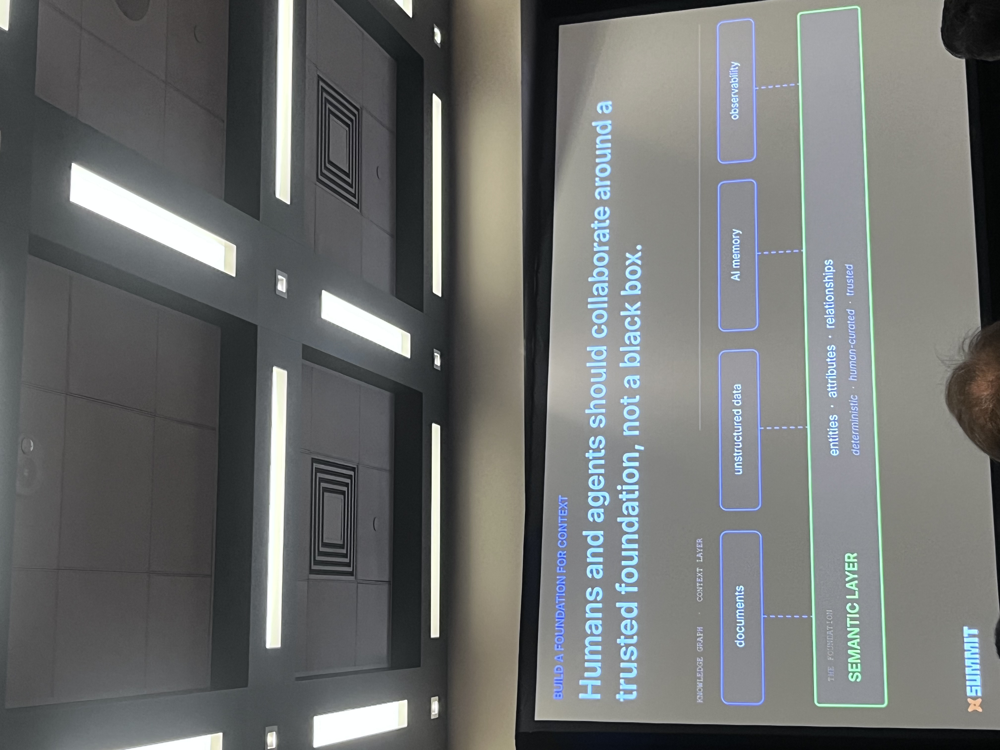
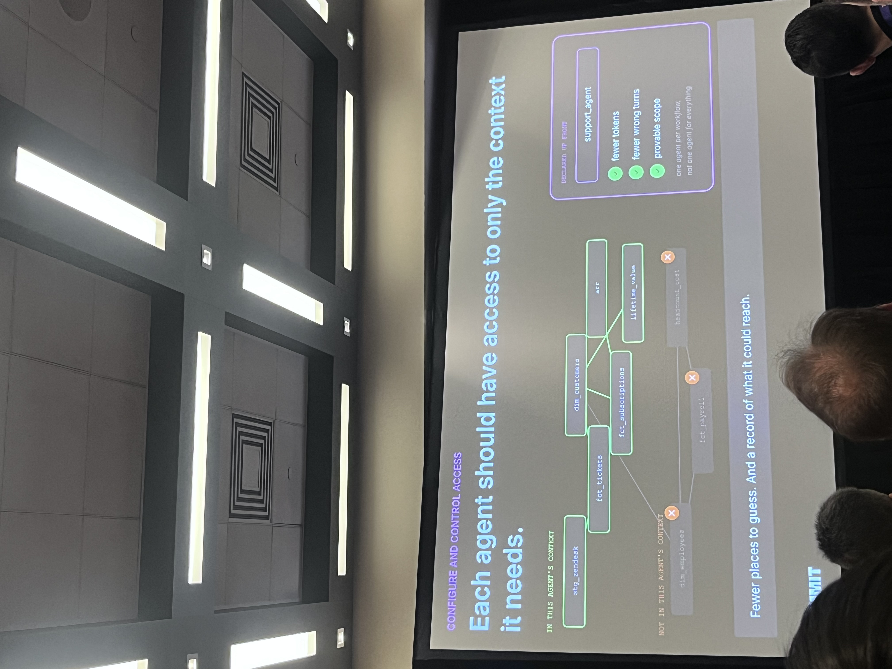

- 최종적으로 두 번째 Semantic Layer 물결이 성공하려면 네 가지 조건이 필요하다고 설명했습니다.

1. **광범위한 통합(Ubiquitous Integration)**: 어떤 BI나 AI 도구에서도 Semantic Layer를 사용할 수 있어야 합니다.
이를 위해 Semantic SQL Interface처럼 기존 도구가 Semantic Layer를 일반적인 SQL 인터페이스로 사용할 수 있는 방식도 소개되었습니다.

2. **유연성(Flexibility)**: 모든 분석 요구를 미리 Semantic Model로 정의할 수는 없습니다.
따라서 애드혹 테이블을 자유롭게 사용하면서도 거버넌스된 Metric은 그대로 활용할 수 있어야 합니다.

3. **변환 레이어(Transform Layer)에서의 활용**: Semantic Layer를 BI나 Agent가 사용하는 마지막 계층으로만 보면 활용 범위가 좁습니다.
- 사전 집계, Feature Store/ Customer 360(?)처럼 Transformation 과정에서도 Semantic 정보를 활용할 수 있어야 한다고 설명했습니다. 

4. **구성 가능성과 접근 제어(Configurability & Access Control)**: Agent에게 모든 데이터를 보여주는 것도 답은 아닙니다.
- 필요한 컨텍스트와 데이터만 접근하도록 제어하고, 어떤 데이터를 근거로 답을 만들었는지 추적할 수 있어야 합니다.

### 총평

> 결국 중요한 것은 Context

- 저도 AI Agent를 데이터에 붙일 때 처음에는 "자연어를 SQL로 얼마나 잘 바꾸는가?"​에 먼저 눈이 갔는데요.
그런데 실제로 사용하고 평가까지 추적하다보면 더 중요한 질문들이 생깁니다.

  - 어떤 데이터를 선택했는가?
  - 우리 회사에서 이 지표를 어떻게 정의하는가?
  - 왜 이 테이블과 컬럼을 사용했는가?
  - 이 결과를 믿을 수 있는 근거는 무엇인가?

- 결국 Agent에게 필요한 것은 스키마나 테이블 목록을 많이 전달하는 것이 아니라, 우리 회사의 데이터를 어떻게 해석해야 하는지에 대한 구조화된 컨텍스트였습니다.

- 개인적으로는 전날 파트너 부스에서 본 Omni, Hex 같은 제품들과도 자연스럽게 연결되는 내용이었습니다. 결국 AI Agent가 데이터를 잘 사용하게 하려면 데이터 자체보다 데이터의 의미와 사용 조건을 어떻게 전달할 것인가가 중요해지고 있었습니다.

- 결국 "Semantic Layer is Dead"는 Semantic Layer가 필요 없어졌다는 뜻이 아니었고(ㅎㅎ) Metric을 일관되게 제공하는 기존 역할을 넘어, AI Agent가 비즈니스를 이해할 수 있도록 컨텍스트를 제공하는 계층으로 확장되고 있다는 의미에 가까웠고 그 방향성으로 설계하는 것에 대한 내용을 담은 발표였습니다!

---

## Data Career Roundtable

다음으로는 **Data Career** 라운드테이블에 참석했습니다. 발표를 듣는 형식이 아니라, 데이터 직군으로서의 커리어 패스에 대해 참가자들이 직접 이야기하는 시간이었습니다.

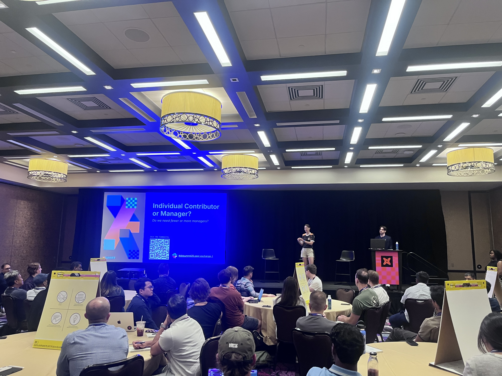

### IC vs. 관리자: 커리어 방향 결정

- 가장 기억에 남았던 주제는 "Individual Contributor로 계속 성장할 것인가, Manager가 될 것인가"​였습니다.

- 진행자는 커리어 방향을 정할 때 단순히 다음 직급이나 연봉을 생각하기보다, 5~10년 뒤 어떤 일을 하고 싶은지 스스로 질문해보는 것이 중요하다고 이야기했습니다.

- 특히 경력이 쌓이면 자연스럽게 Manager가 되어야 한다고 생각하기 쉽지만, 반드시 관리자가 되는 것만이 성장의 방향은 아니라는 이야기도 나왔습니다. 

- 사람과 조직의 성장을 돕는 일에 더 관심이 있다면 Manager가 맞을 수 있고, 반대로 기술적인 문제를 깊게 해결하거나 직접 만드는 일을 계속하고 싶다면 IC로 성장하는 방향도 충분히 좋은 선택이라는 이야기였습니다.

- 저 역시 8년차로 접어들게되면서, 특히 AI 시대로 넘어가며 한 번씩 고민하게 되는 부분이라 꽤 흥미롭게 들었습니다. 지금 당장 IC와 Manager 중 하나를 선택한다기보다, 앞으로 내가 어떤 문제를 풀고 싶은지, 그리고 어떤 방식으로 팀에 기여하고 싶은지를 먼저 생각해봐야 한다​는 점이 중요하지 않을까 생각해보았습니다 ㅎㅎ

### 라운드테이블에서 이어진 스몰토크

- 라운드테이블이다 보니 자연스럽게 옆에 앉은 참가자들과 이야기를 나눌 기회도 많았습니다. 그중 텍사스에서 온 데이터 엔지니어와 꽤 오랜 시간 이야기를 나눴습니다.

- 처음에는 서로 어디에서 왔는지 이야기하면서 가벼운 대화부터 시작했습니다. (텍사스에서 라스베이거스까지 얼마나 걸리는지, 한국에서 미국까지는 얼마나 걸렸는지, 삼성 주식이 왜 이렇게 올랐는지 ㅋㅋㅋ)

- 그러다 다시 커리어 이야기로 돌아와 서로 어떤 일을 하고 있는지, 데이터 엔지니어링 쪽으로 어떻게 커리어를 옮기게 되었는지에 대해서도 이야기했습니다.

- 최근 업무에서 AI를 어떻게 사용하고 있는지도 이야기했는데, AI 도구를 실제 개발 과정에서 어떻게 활용하고 있는지 서로 경험을 공유했습니다. 같은 데이터 엔지니어라고 해도 회사나 환경에 따라 AI 도구를 사용하는 방식이 조금씩 달라서 이런 이야기를 직접 들어보는 것도 흥미로웠습니다.

- 개인적으로 이 시간은 세션 내용만큼이나 기억에 남았습니다. 해외 컨퍼런스에 와서 유명한 발표를 듣는 것도 좋지만, 비슷한 일을 하는 다른 나라의 엔지니어가 어떤 환경에서 일하고 있고, 어떤 커리어 고민을 하고 있는지 직접 들어볼 수 있다는 것도 컨퍼런스의 큰 장점​이라는 생각이 들었습니다.

- 영어가 편한 편은 아니라 처음에는 이런 라운드테이블 세션이 조금 부담스럽기도 했는데, 막상 이야기를 시작하니 생각보다 자연스럽게 대화가 이어졌습니다. 돌이켜보면 이번 Summit에서 발표를 듣는 것과는 또 다른 방식으로 기억에 남은 시간이었습니다.

- 자연스럽게 서로 링크드인을 교환하고, 남은 시간 잘 보내라고 서로 응원해주었습니다!

## 점심, 그리고 바로 다음 세션으로

라운드테이블이 끝난 뒤에는 점심을 먹었습니다. 그런데 바로 다음 세션으로 이동해야 해서 여유롭게 먹지는 못했습니다.

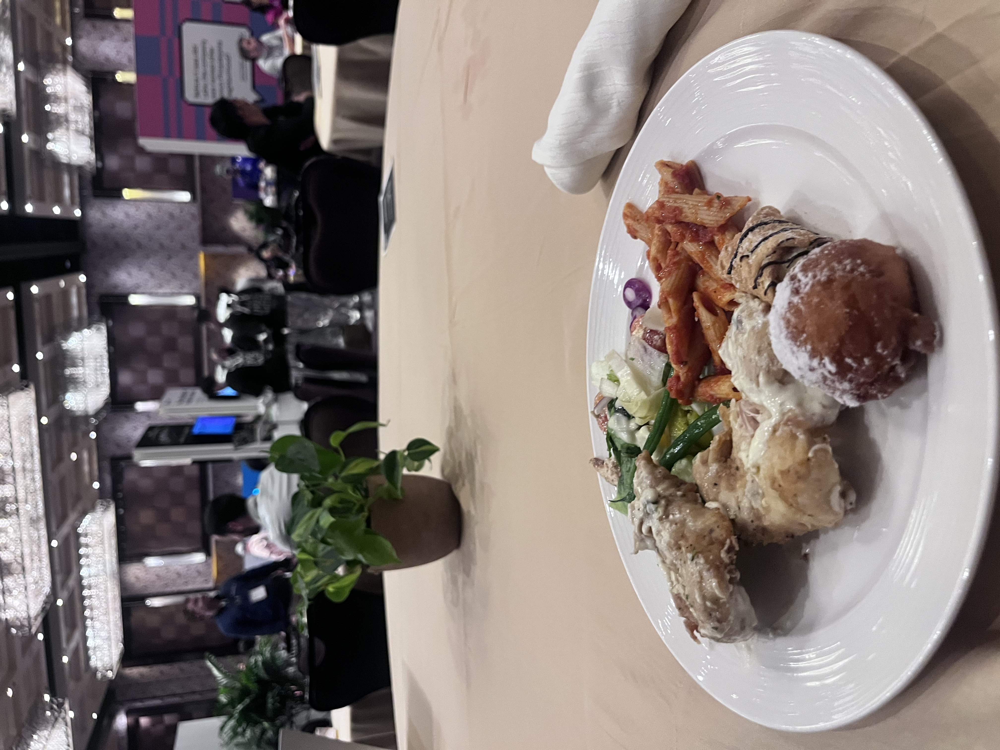

컨퍼런스에서 점심 사진은 항상 여유로워 보이지만, 실제로는 다음 세션 시간을 보면서 허겁지겁 먹고 일어나는 경우가 많았습니다. 이날도 그랬습니다. 😅 (친구 없어서 아닙니다)

---

## Standardizing Insights with dbt Semantic Layer

점심 뒤에는 **Standardizing Insights with dbt Semantic Layer** 세션에 참석했습니다. 이 세션은 발표만 듣는 시간이 아니라 실제 hands-on 워크숍이었습니다.

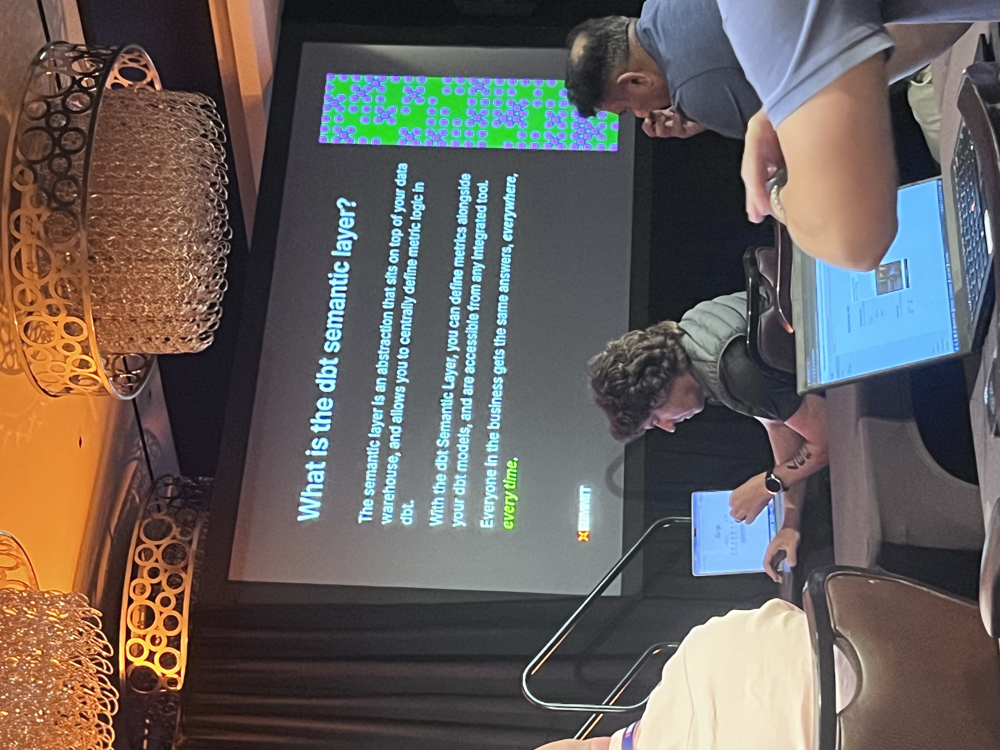
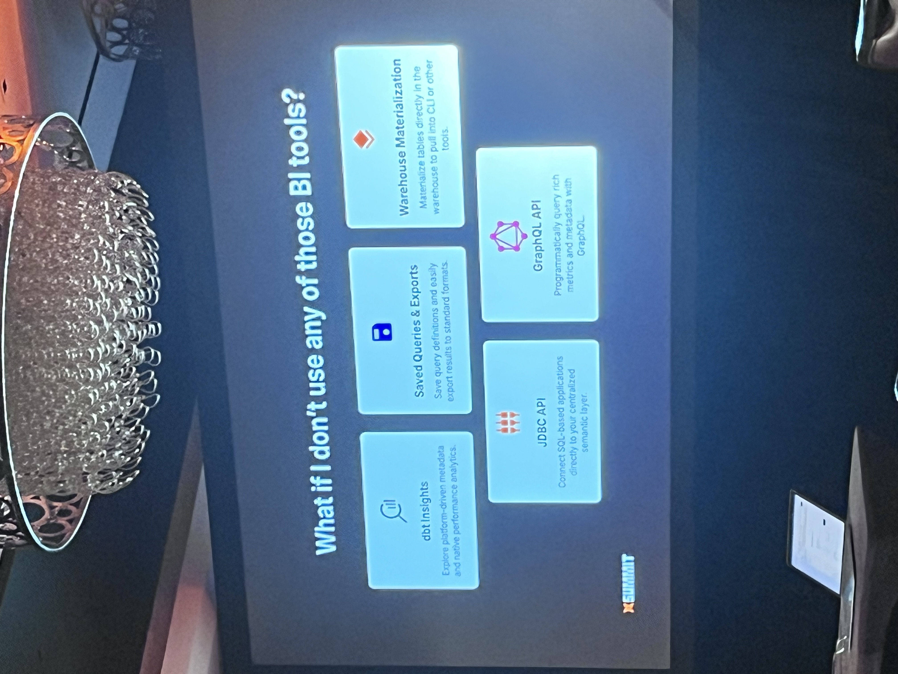

좋았던 점은 해당 세션은 실시간 통역을 제공하여 아래 사진처럼 모르는 부분이 있으면 바로바로 잡아나갈 수 있었습니다!
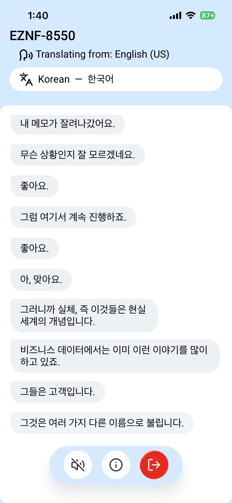

이 워크숍은 dbt Semantic Layer의 개념 소개부터 시작해, YAML 설정과 메트릭 연결, Semantic Model 구성, MetricFlow를 활용한 쿼리 방식까지 이어졌습니다. 
- 세션 자료와 슬라이드는 GitHub에도 공개되어 있으니 참고하실 분은 참고 부탁드립니다!
  - [Standardizing Insights with the dbt Semantic Layer 슬라이드](https://github.com/dbt-labs/dbt-summit-26-Standardizing-insights-with-the-dbt-Semantic-Layer/tree/main/_slides)

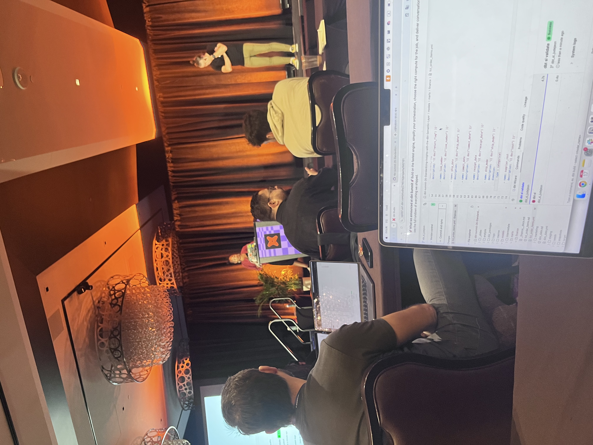
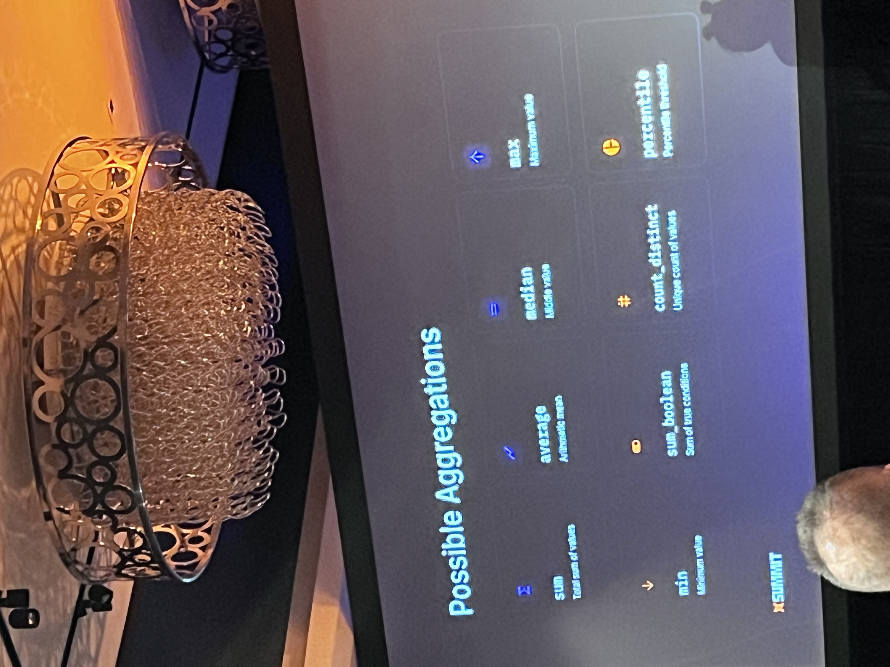

- 제가 특히 보고 싶었던 부분은 dbt 위에 MetricFlow를 붙여 실제로 어떻게 지표를 정의하고 조회하는지였습니다. 현재는 dbt Core를 활용하고 있기 때문에, Semantic Layer와 MetricFlow를 기존 환경에 어떻게 연결할 수 있을지 궁금한 부분이 많았습니다.
  - 일전에 POC단계에서 도입 검토를 진행했지만, 저희 업무 워크플로우 상 metricflow를 활용하기보다는 직접 커스텀한 형식의 시멘틱 레이어를 구성하는 쪽으로 결정되었었습니다.

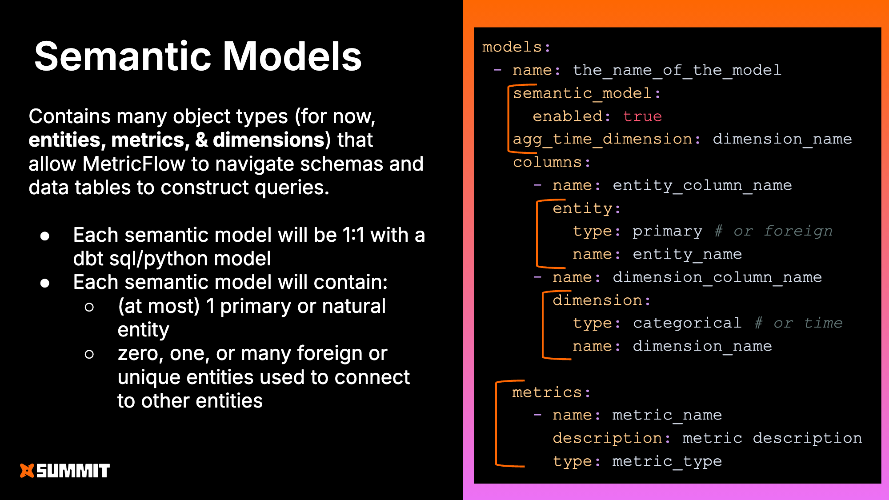
- 직접 실습을 해보니 dbt Semantic Layer가 단순히 추상적인 개념이 아니라, 기존 모델 위에 Semantic Model과 Metric을 정의하고, 같은 지표를 여러 소비 도구에서 일관되게 사용할 수 있도록 연결하는 방식이라는 점이 조금 더 선명해졌습니다.

- POC 당시 [참조했던 문서](https://docs.getdbt.com/docs/build/metrics-overview?version=2)와 크게 달라진 부분은 없어서 핸즈온 세션은 이만 줄이도록 하겠습니다.

---

## How Okta Governs Context for Agents at Scale

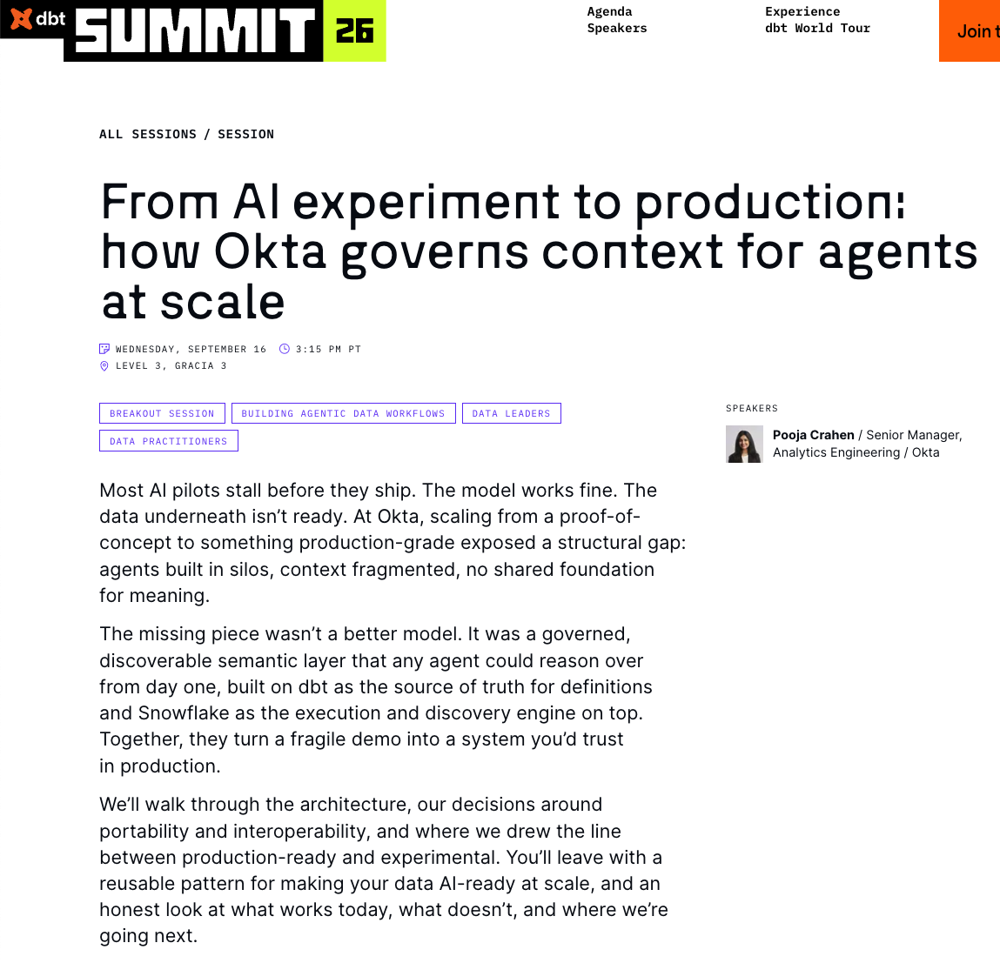

다음으로는 How Okta Governs Context for Agents at Scale 세션을 들었습니다. 앞선 세션들이 Semantic Layer를 통해 Agent에게 데이터의 의미를 어떻게 전달할 것인지에 가까웠다면, 이번 세션은 한 단계 더 나아가 Agent가 사용하는 Context를 실제 조직에서 어떻게 관리하고 운영할 것인가​에 초점을 맞춘 내용이었습니다.

발표에서 먼저 이야기한 문제는 Agent마다 필요한 정의와 로직을 따로 가지고 있다는 것이었습니다. 이렇게 되면 같은 데이터를 사용하는 Agent라도 서로 다른 정의를 참고할 수 있고, 해당 로직이 실제 데이터 모델과 연결되어 있지 않아 변경 사항을 추적하거나 관리하기도 어려워집니다.

결국 Agent를 많이 만드는 것보다 먼저 Agent가 신뢰할 수 있는 Context를 어떻게 만들고 관리할 것인지가 필요하다는 이야기였습니다.

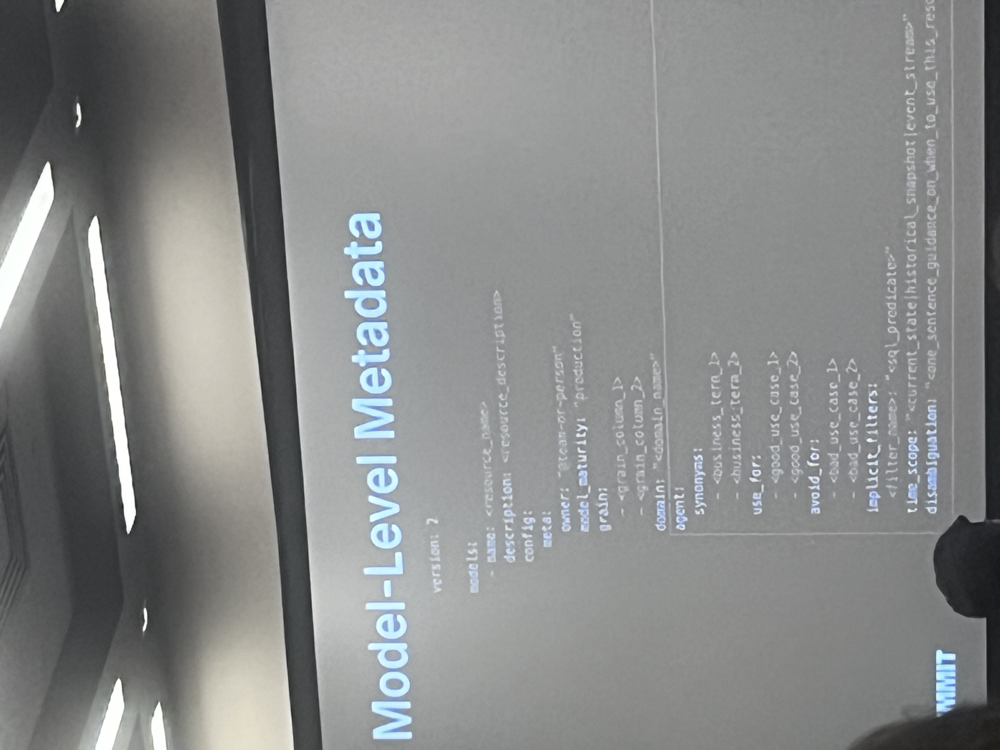
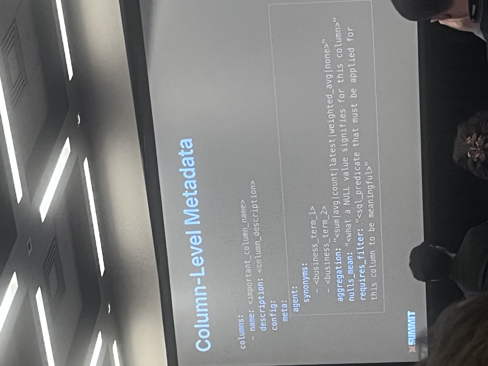

- Model-Level에서는 해당 모델이 어떤 목적으로 만들어졌고 어떤 질문에 사용해야 하는지와 같은 정보를 정의하고, 
- Column-Level에서는 컬럼의 의미뿐만 아니라 SUM과 AVG 중 어떤 집계 방식을 사용해야 하는지와 같은 구체적인 사용 규칙까지 관리하는 방식이었습니다.

- 즉 Agent에게 테이블과 컬럼 목록만 전달하는 것이 아니라,

  - 이 모델은 언제 사용해야 하는지
  - 각 컬럼은 어떤 의미인지
  - 어떤 집계 방식을 사용해야 하는지
  - 어떤 모델을 우선적으로 선택해야 하는지
  - 사용할 때 주의해야 할 비즈니스 규칙은 무엇인지

같은 정보까지 Context로 제공하는 것입니다.

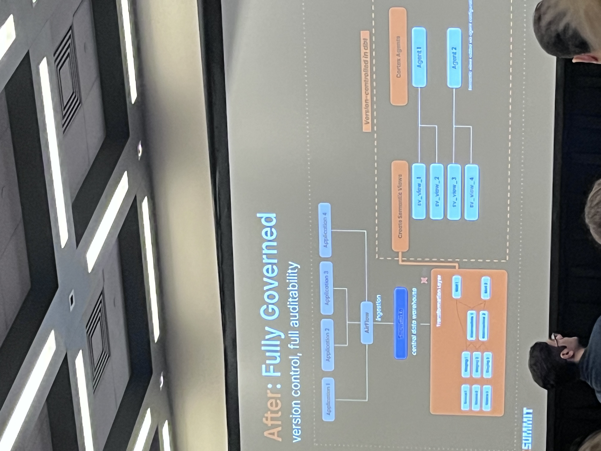

- 에이전트가 참조하는 자산을 단순히 복제해서 분산시키기보다 단일 소스를 유지하는 것이 중요하다는 메시지도 있었습니다. 
- 이 부분은 기존 데이터 거버넌스의 문제와 같다는 생각이 들었고, 사람이 쓰는 데이터든, 에이전트가 쓰는 데이터든, 결국 신뢰할 수 있는 정의와 출처가 있어야한다 라는 내용이었습니다.

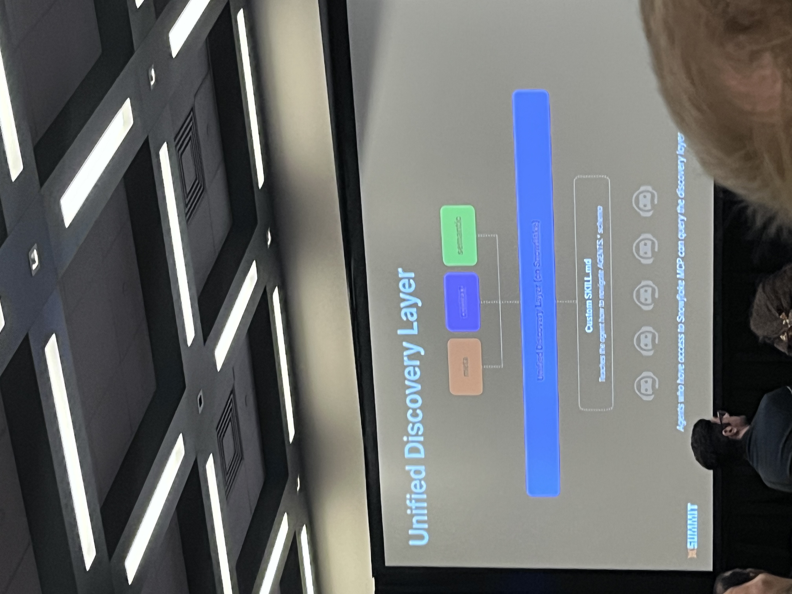

- 이렇게 관리되는 Context를 특정 Agent에서만 사용하는 것이 아니라, 여러 Agent가 공통으로 발견하고 사용할 수 있도록 만드는 Discovery Layer도 소개되었습니다.

- 결국 중요한 것은 Agent마다 Context를 새롭게 만드는 것이 아니라, 이미 관리되고 있는 Model Metadata, Column Metadata, Business Rule, Metric 등의 정보를 필요한 Agent가 찾아서 사용할 수 있도록 만드는 것입니다.

- 이 구조가 만들어지면 새로운 Agent가 추가되더라도 처음부터 모든 비즈니스 로직을 다시 정의할 필요 없이, 기존에 관리되고 있는 Context를 활용할 수 있다는 내용이었습니다.

### 총평
- 이번 세션에서 가장 인상적이었던 점은 Agent마다 Context를 따로 만드는 것이 아니라, Context 자체를 하나의 관리 대상처럼 다룬다는 점이었습니다. 

- Model과 Column에 사용 목적이나 집계 규칙을 정의하고, 공통 Context와 도메인별 Context를 구분해 필요한 Agent가 활용하도록 하는 방식이었습니다.

- 아쉬웠던 부분은 실제 적용되는 사례를 보고 싶었는데, 발표 내용만으로는 다소 추상적이고 이론적으로 느껴졌습니다 ㅠㅠ

--- 

## With Great Context Comes Great Autonomy: Leveling Up Your Agent Context
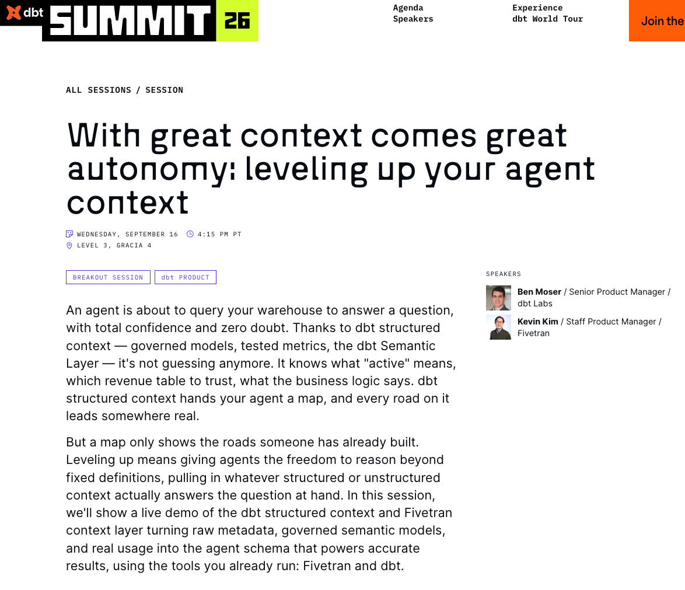

마지막으로 들은 세션은 With Great Context Comes Great Autonomy: Leveling Up Your Agent Context였습니다. 제목처럼 Agent Context가 충분히 좋아져야 에이전트의 자율성도 높아질 수 있다는 내용이었습니다. 
(계속 비슷한 이야기지만 개인적으로 좋았던 세션이라 남겨둡니다.)

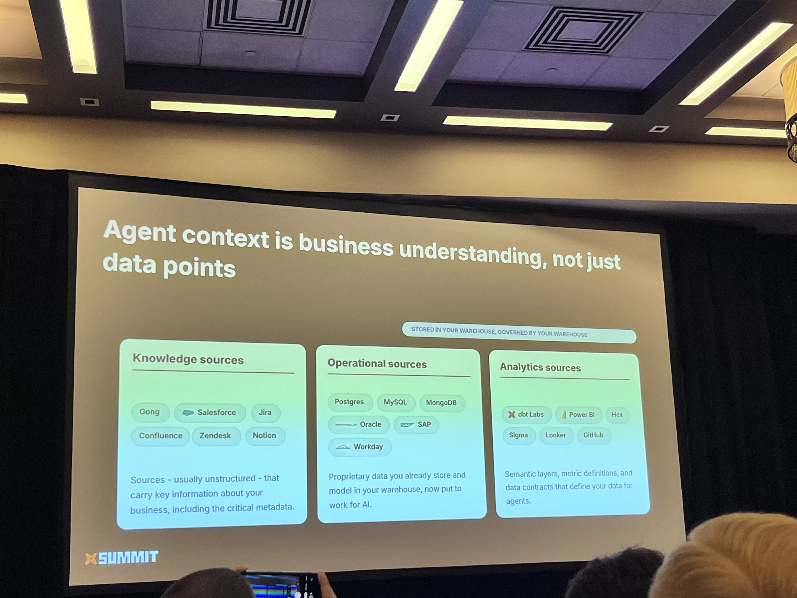

- 이 세션에서는 Agent Context의 출처를 크게 Knowledge Sources, Operational Sources, Analytical Sources 세 가지로 구분했습니다. 
  - Knowledge Sources에는 문서나 Wiki처럼 비즈니스의 용어와 개념을 설명하는 정보가 있고
  - Operational Sources에는 Database, ERP, CRM과 같은 운영 데이터가 있습니다. 
  - Analytical Sources에는 dbt에서 만든 데이터 모델과 Metric Definition, Hex나 Sigma 같은 분석 도구에 존재하는 정보가 포함됩니다

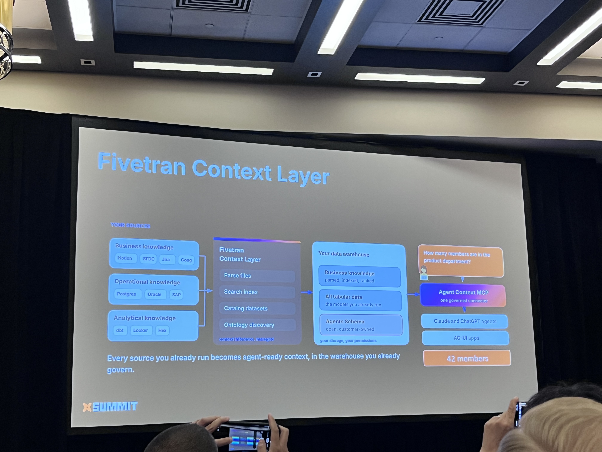

- 단순히 여러 시스템을 연결하는 것에서 끝나는 것은 아니었습니다. 
  - 연결된 데이터와 문서를 읽어 Search Index와 Vector Embedding을 만들고, Catalog를 구성한 뒤 Ontology Discovery를 통해 서로 다른 Source에 존재하는 개념과 의미를 연결하는 방식도 소개했습니다. 
  - 예를 들어 Postgres의 Revenue 테이블과 Notion에 작성된 Revenue 관련 정의를 연결해, Agent가 질문을 받았을 때 필요한 데이터와 비즈니스 정의를 함께 찾을 수 있도록 하는 구조였습니다.

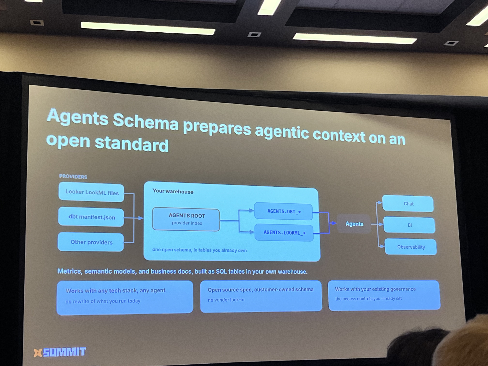

- 특히 흥미로웠던 부분은 이렇게 만들어진 Context를 특정 서비스 내부에서만 사용하는 것이 아니라, Agent Schema라는 테이블 형태로 데이터 웨어하우스에 저장한다는 점이었습니다. 
  - 발표에서는 이를 Open하고 Interoperable한 구조라고 설명했는데, Context 자체를 사용자가 소유하고 직접 조회하거나 다른 Agent에서 활용할 수 있도록 하려는 접근이라고 생각합니다.

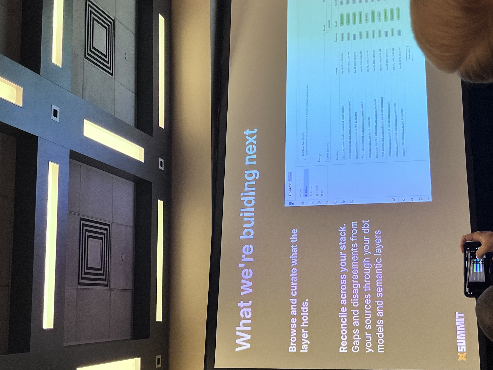

- 발표에서는 Trace를 통해 Agent가 어떤 Context를 사용했는지, 정의를 어디에서 가져왔는지, 어떤 실행에서 잘못된 결과가 발생했는지를 확인하는 방향을 소개했습니다. 
  - 또한 Notion의 정의와 dbt Model의 정의가 서로 충돌하거나 아직 매핑되지 않은 용어가 존재하는 경우 이런 Context Gap을 찾아내고 사람이 다시 큐레이션할 수 있도록 하는 기능도 설명했습니다
  - 발표에서는 실제 fivetran에서 개발중인 제품 데모도 보여줬는데, 완성도가 높아서 박수를 많이 받았습니다! (대단)
  - [구글링](https://www.fivetran.com/blog/announcing-fivetran-context-layer)해보니 실제로 announce 된 제품으로 보이네요!

### 총평
- 앞선 세션들과 비슷하게 Context의 중요성을 다루고 있었지만, 단순히 개념적인 이야기에서 끝나지 않고 Context를 어떻게 수집하고, 연결하고, Agent에게 제공하고, 다시 검증할 것인지​까지 구체적인 방법론과 제품으로 보여준 점이 좋았습니다.
- 정리하자면 아래와 같습니다!
  - Metadata Connectors: dbt Semantic Layer, Looker, Sigma, Power BI 등의 기존 Semantic 자산을 Context로 활용
  - Lineage & Ontology Discovery: 여러 Metadata/Wiki/Application에서 개념을 발견하고 서로 연결
  - Search-optimized Data Connectors: Confluence, Google Drive, Jira, Zendesk 등의 비정형 정보를 Parse/Index
  - Agents Schema: Context를 특정 벤더 내부 포맷이 아니라 Open-source specification 기반의 일반 SQL Table로 Warehouse에 저장
  - Agent Context MCP: Agent가 이 Context에 접근할 수 있는 공통 Interface 제공
  - ⭐⭐ Traces & Evals: Agent의 답변뿐 아니라 사용한 SQL/문서와 Agent가 사용한 가정까지 Warehouse에 기록해 Context 품질을 검증

--- 

## 둘째 날 총평
둘째 날은 하루 전체가 비슷한 주제로 이어지는 느낌이었습니다. 키노트에서는 AI 에이전트 시대에 데이터팀이 제공해야 할 표준과 맥락을 이야기했고, Semantic Layer 세션에서는 그 표준이 왜 다시 중요해졌는지 설명했습니다.

Data Career 라운드테이블에서는 기술이 아닌 커리어적인 이야기를 들을 수 있었고, dbt Semantic Layer hands-on에서는 MetricFlow를 실제로 어떻게 활용할 수 있을지 감을 잡을 수 있었습니다. 뒤이어 들은 Context 관련 세션은 AI 에이전트가 데이터를 안전하고 일관되게 쓰기 위해 필요한 운영 체계를 보여주었습니다.

연달아 세션을 들어 무척 피곤했지만, 호텔 근처에 시설들을 구경하고 라스베가스 특유의 활기찬 분위기를 즐길 수 있었습니다.

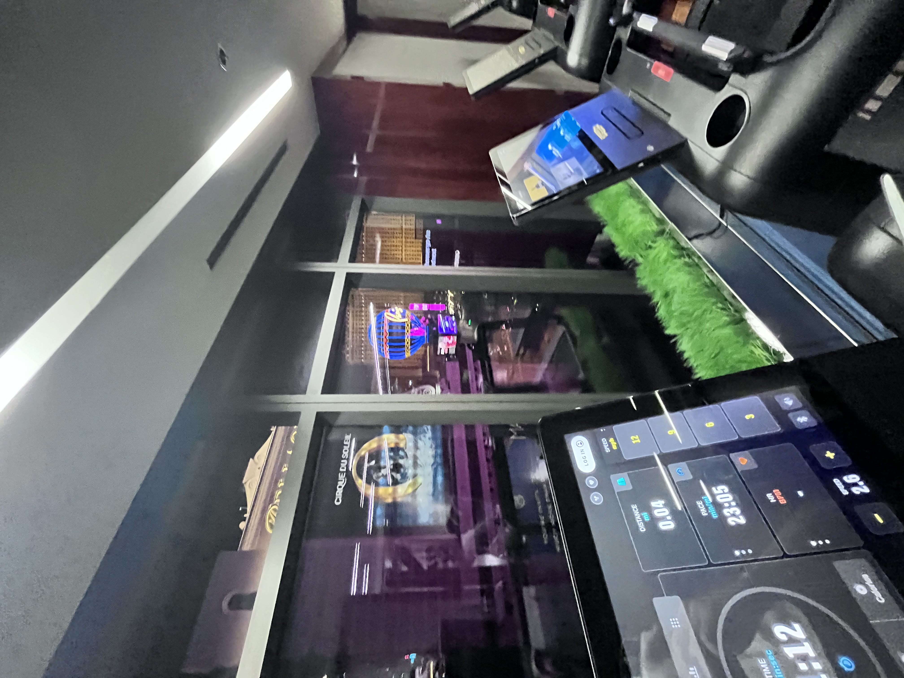
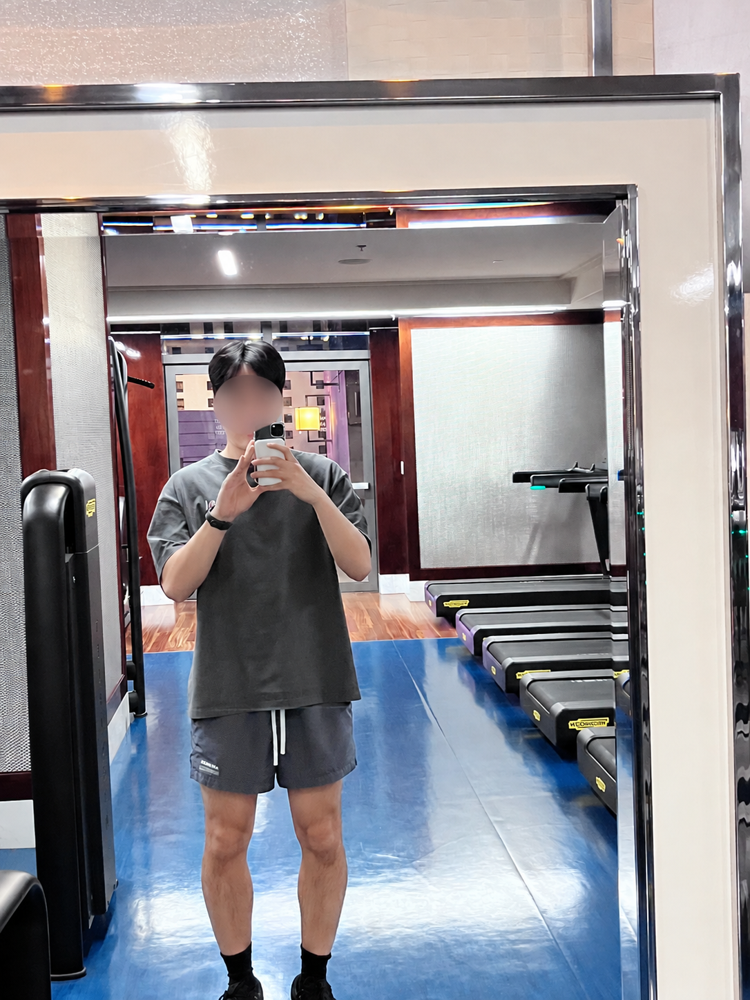

잠들기전 헬스장까지 완벽했네요! (*코스모폴리탄 호텔의 첼시타워 헬스장은 일찍 문을 닫아, 24시 운영하는 블루바드 타워로 가시는 것을 추천합니다! )

다음 글에서는 이어지는 컨퍼런스 3일차 이야기를 정리해 보겠습니다. 👋

---

**dbt Summit 2026 출장 기록**

1. [출국/도착](/posts/dbt-summit-2026-01-departure-arrival/)
2. [DBT 컨퍼런스 1일차](/posts/dbt-summit-2026-02-day-1/)
3. **DBT 컨퍼런스 2일차 — 현재 글**
4. DBT 컨퍼런스 3일차 — 작성 예정
5. DBT 컨퍼런스 4일차 — 작성 예정
6. 한국 복귀와 느낀 점 — 작성 예정
