3일차는 전날보다 조금 더 실무적인 세션을 많이 들었습니다. 둘째 날에는 dbt의 방향성과 Semantic Layer, Agent Context 같은 큰 흐름을 따라갔다면, 셋째 날에는 각 회사가 이 흐름을 실제 제품과 조직 안에서 어떻게 구현하고 있는지에 더 가까운 내용이 많았습니다.

---

## 에그슬럿으로 시작한 아침, 그리고 헬스장 🥚

아침은 가볍게 에그슬럿에서 먹었습니다. 컨퍼런스 일정이 이어지다 보니 아침을 대충 넘기기 쉬운데, 그래도 이날은 오전 세션이 늦게 시작하여, 시작 전에 뭔가 먹고 움직일 수 있었습니다.
베이컨 에그앤치즈와 슬럿을 별도로 시켜서 먹었는데. 맛있긴 했지만 한국음식 만큼은 아니었습니다 ㅎㅎ..
위치는 블러바드타워 2층에 있었고, 다행히 줄은 길지 않아 5분안에 주문할 수 있었어요.

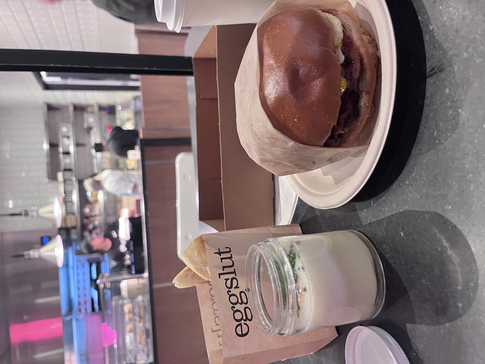

아침을 먹고 나서는 잠깐 배를 소화시킬겸 헬스장에도 들렀습니다. 라스베이거스에서 컨퍼런스를 들으러 온 일정이었지만, 중간중간 시차로 인해 뭉친 몸을 움직여야 하루를 버틸 수 있겠더라구요.

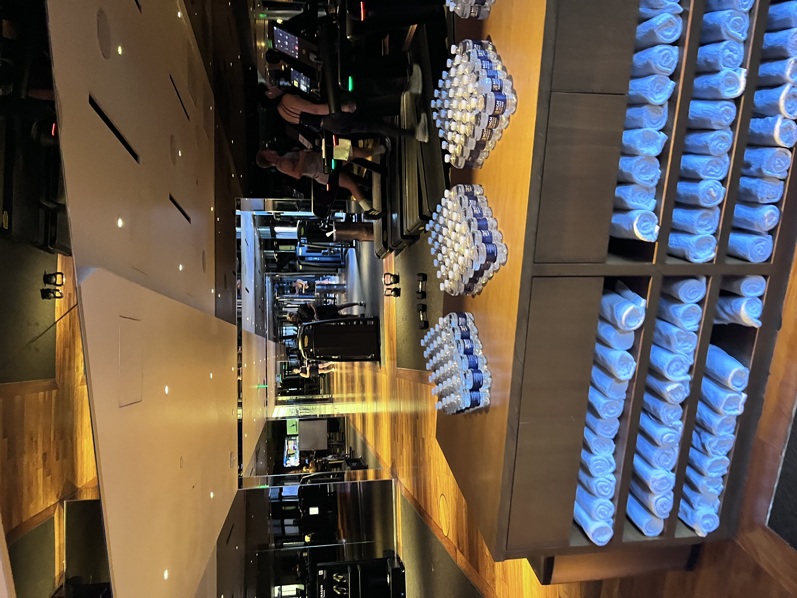
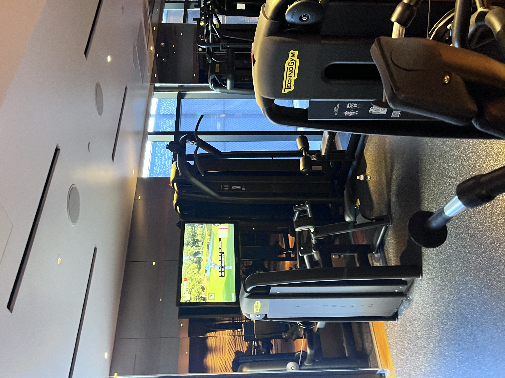

---
## How Sigma manages the semantic layer with dbt and Dagster

첫 번째로 들은 세션은 Sigma의 Semantic Layer 관련 세션이었습니다. 전날부터 Semantic Layer 이야기를 계속 듣고 있었는데, Sigma 세션은 이 개념을 실제 BI 제품과 dbt 프로젝트 안에서 어떻게 다룰 수 있는지 보여주는 쪽에 가까웠습니다.

- 발표에서는 모델 성능 자체보다 **데이터의 근거와 일관성**이 더 중요할 수 있다는 이야기가 나왔습니다.
- 아무리 좋은 기초 모델을 쓰더라도, 그 모델이 참조하는 데이터 정의가 흔들리면 결과를 신뢰하기 어렵습니다. 그래서 발표에서는 단일 진실 공급원, 즉 unified source of truth의 중요성을 다시 강조했습니다.

- 흥미로웠던 부분은 Semantic Model을 단순히 Metric 정의 묶음으로만 보지 않았다는 점입니다.
- 전통적인 큐브 모델처럼 Fact, Dimension, Metric, Relationship을 정의하는 것에서 시작하지만, 최근 도구들은 여기에 주석, 동의어, 검증된 쿼리, SQL 생성 규칙 같은 요소를 더하고 있었습니다.

- 이 흐름은 전날 Semantic Layer 세션에서 이야기한 Agent Context와도 이어졌습니다. 사람이 대시보드를 볼 때는 화면에 보이는 숫자만으로도 어느 정도 맥락을 보완할 수 있지만, AI Agent가 데이터를 사용할 때는 용어의 동의어, 계산 규칙, 조인 방식, 검증된 질문 예시까지 함께 있어야 합니다.
- 그래야 Agent가 단순히 SQL을 생성하는 수준을 넘어, 우리 조직이 의도한 의미에 맞게 데이터를 사용할 수 있습니다.

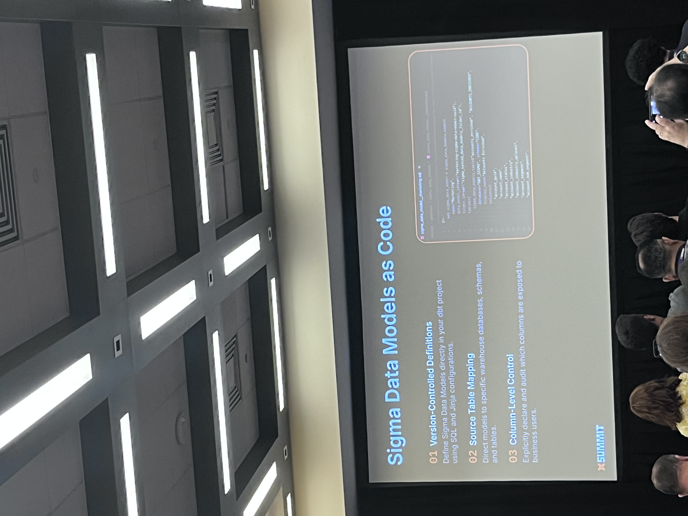

- 또 하나 인상적이었던 점은 Sigma 데이터 모델을 dbt 프로젝트 안에서 코드 기반으로 표현하고 관리하는 방식이었습니다.
  - 기존 BI 도구에서는 UI에서 테이블을 가져오고 Relationship을 연결하는 방식이 일반적이었다면, 여기서는 Semantic Model 역시 dbt 프로젝트의 코드 자산으로 관리하고 있었습니다.
- 발표에서는 dbt 프로젝트에서 Sigma Data Model을 정의하고, 배포 과정에서 이를 컴파일한 뒤 REST API를 통해 Sigma에 반영하는 흐름을 소개했습니다.
  - 이를 통해 Semantic Model 역시 기존 dbt 모델과 함께 Git에서 변경 이력을 관리하고, 리뷰와 배포 프로세스 안에 포함시킬 수 있었습니다.

- 개인적으로는 Semantic Layer도 결국 하나의 소프트웨어 자산처럼 관리되고 있다는 점이 흥미로웠습니다.
  - Metric이나 Relationship 같은 비즈니스 정의도 점점 복잡해지는 만큼, 데이터 모델과 마찬가지로 코드 기반의 변경 관리와 배포 과정이 필요해지고 있다는 생각이 들었습니다.

- 모든 데이터를 하나의 거대한 Semantic Model에 넣기보다는 Sales, Marketing, Engineering, Finance처럼 비즈니스 도메인 단위로 나누어 관리하고 있었습니다.
  - 각 도메인의 담당자나 Analyst가 자신의 Semantic Model에 피드백을 주고 관리하는 구조였습니다.
  - 데이터 모델링에서도 Domain Ownership이 중요하듯이, Semantic Layer 역시 규모가 커질수록 누가 해당 데이터의 의미를 정의하고 관리할 것인지가 중요하다는 점이 인상적이었습니다.

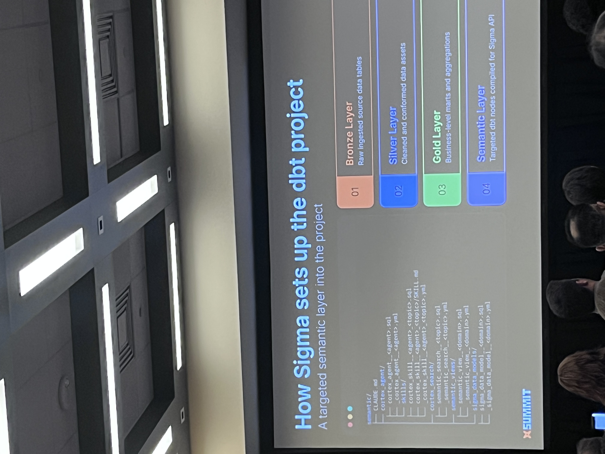

- 또한 메달리온 아키텍처에 Semantic Layer를 덧붙이는 구조도 언급되었습니다.
- Bronze, Silver, Gold처럼 데이터를 정제하고 비즈니스 레벨로 끌어올리는 계층 위에, Cortex Agent, 검색 서비스, Semantic View, Sigma Data Model 같은 시맨틱 객체를 추가로 구성하는 방식이었습니다.

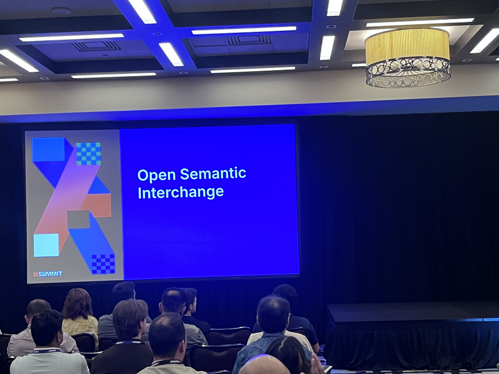
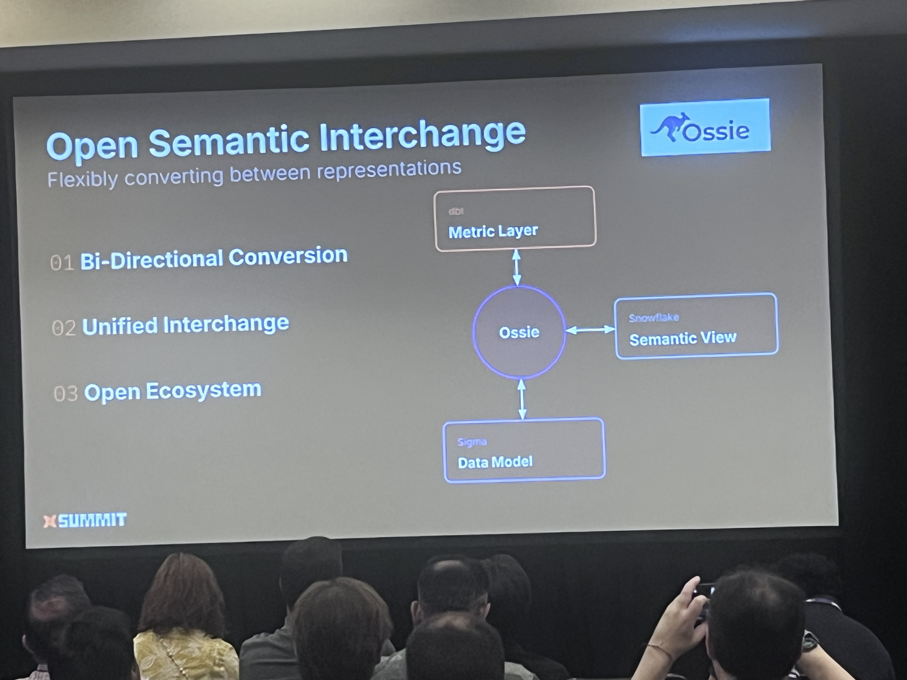

- 이어서 발표는 **Open Semantic Interchange**로 넘어갔습니다. 지금 업계의 Semantic Layer는 도구마다 표현 방식이 다르고, 각 도구가 자체적인 컴포넌트와 모델링 방식을 가지고 있습니다. 이 상태에서는 한 도구에서 정의한 데이터 모델을 다른 도구로 옮기거나, 여러 시스템이 같은 의미 정의를 공유하기가 어렵습니다.

- Open Semantic Interchange는 이런 파편화된 표현 방식 사이에서 중간 지점 역할을 하려는 시도로 소개되었습니다.
- 발표에서는 이 약칭이 앞으로 **Ossie**로 바뀔 예정이라고 설명했습니다.
- 핵심은 Sigma만을 위한 표현을 하나 더 만드는 것이 아니라, 여러 도구가 이해할 수 있는 중앙의 데이터 표현을 만들고, 그 표현을 기준으로 각 시스템으로 변환할 수 있게 하는 것이었습니다.
- 실제로 실무를 진행하면서 과거 OSI,현 OSSIE에서 제공하는 [SPEC](https://github.com/apache/ossie/blob/main/core-spec/spec.md)을 참고하여 Semantic Layer를 구성했는데, 여기서 새롭게 언급이 되니 되게 반가웠습니다.

### 총평
- 이 외에도 Agent와의 결합 등 활용 방식에 대한 이야기와 Dagster와 결합된 운영방식에 대한 이야기를 들었으나, 내용은 생략했습니다.
- 이번 세션에서는 Semantic Model을 dbt 프로젝트 안에서 코드로 관리하고 기존 배포 흐름에 포함시키는 방식이 가장 인상적이었습니다. Semantic Layer도 결국 데이터 모델과 마찬가지로 버전 관리, 리뷰, 배포가 필요한 하나의 엔지니어링 자산이 되어가고 있다는 생각이 들었습니다.
- 그 외에도 Ossie를 중심으로 Semantic Layer를 표준화하고, 이를 다양한 솔루션에서 활용하려는 흐름을 확인할 수 있었습니다.

---

## 쉬는 시간: dbt Charts 다시 보기

중간에 시간이 조금 남아서 dbt Charts 관련 내용을 다시 살펴봤습니다. 전날 키노트에서도 짧게 언급했는데, 실제로 다시 보니 dbt가 Transformation 이후의 영역까지 계속 넓히고 있다는 인상이 더 강해졌습니다.

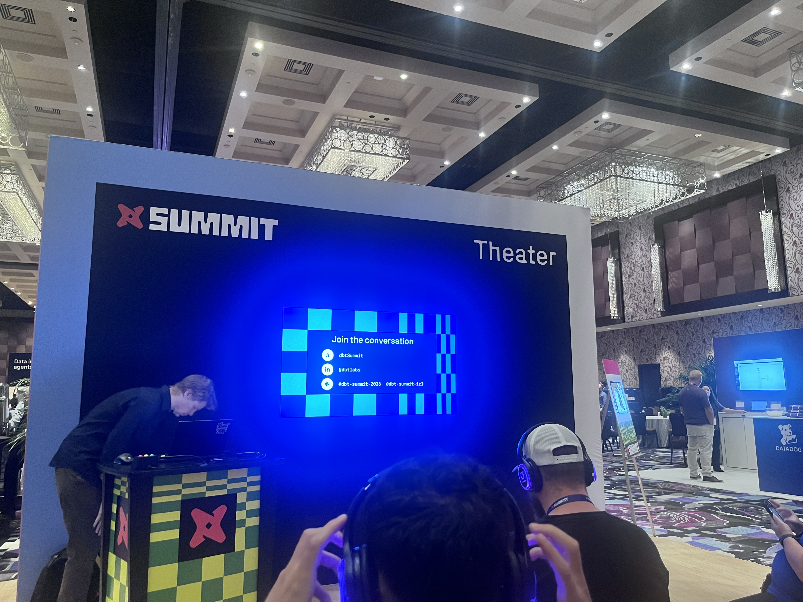

- 전날 정리한 것처럼 [dbt Charts](https://github.com/dbt-labs/dbt-charts)는 대시보드를 코드로 관리하려는 시도에 가깝습니다. SQL 모델은 이미 Git, PR, CI 안에서 관리하는데, 마지막 결과물인 대시보드는 BI 도구 안에서 별도로 관리되는 경우가 많습니다. dbt Charts는 차트와 대시보드 정의까지 코드로 가져와서, 모델과 같은 리뷰 흐름 안에서 관리하려는 방향으로 보였습니다.

- 이 내용은 [2일차 키노트 정리](/posts/dbt-summit-2026-03-day-2/)에서도 잠깐 언급했습니다. 다만 개인적으로는 여전히 궁금한 지점이 남았습니다. 대시보드까지 코드화하는 방향은 분명 매력적이지만, 실제 팀에서 이미 BI 도구를 적극적으로 쓰고 있다면 dbt 프로젝트 안에 어디까지 정의를 가져오는 것이 적절한지에 대한 판단이 필요해 보였습니다.

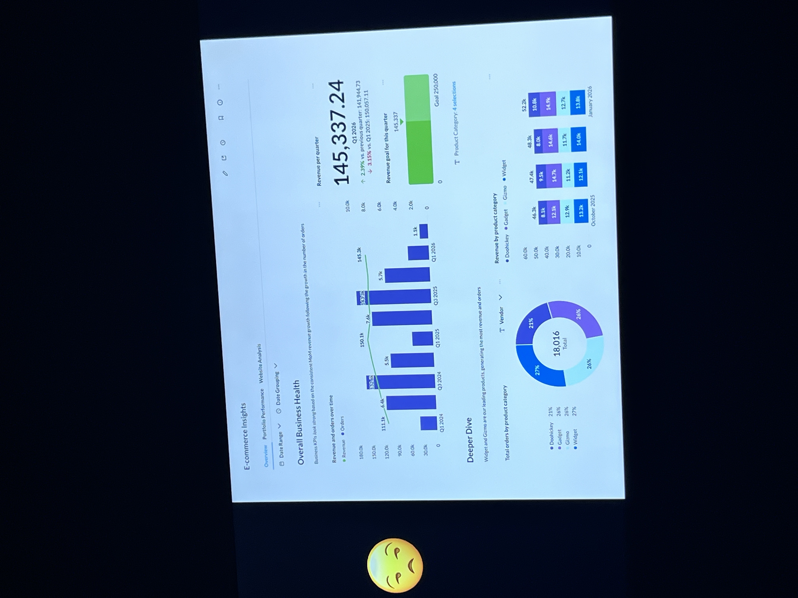

그 외에도 Metabase 등 다른 BI 도구와의 차이점과, 사용자가 시각화된 정보를 더 빠르고 직관적으로 이해할 수 있도록 설계한 부분에 대한 설명을 들었습니다. 실제로 Label + Value 표기 방식이나 다양한 시각화 방식에서 차별화를 시도한 부분은 이해했지만, 기존 도구와 비교했을 때 큰 차별점이 있다는 인상을 받지는 못했습니다.

---

## Is Context Engineering the New Analytics Engineering?

다음 세션입니다. 1~2일차 글에서 Semantic Layer와 AI Agent 이야기를 이미 많이 다뤘기 때문에, 여기서는 새롭게 느낀 부분만 정리해보려고 합니다.

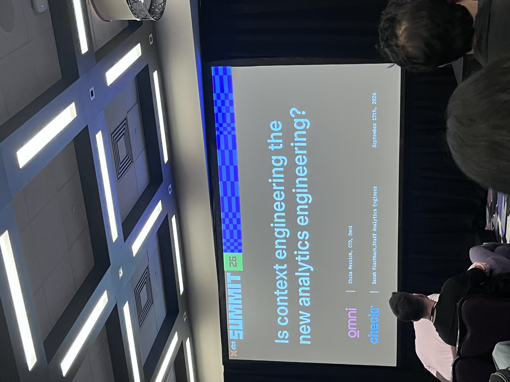

세션의 핵심은 “AI가 데이터를 잘 쓰게 하려면 무엇을 컨텍스트로 만들어야 하는가?”에 가까웠습니다.

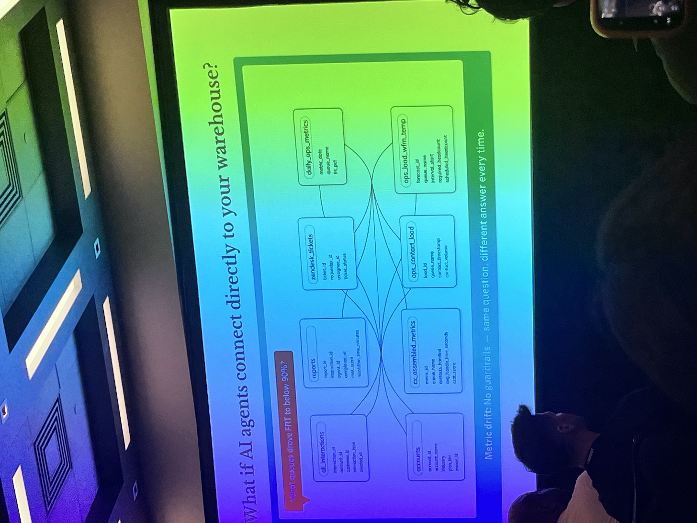
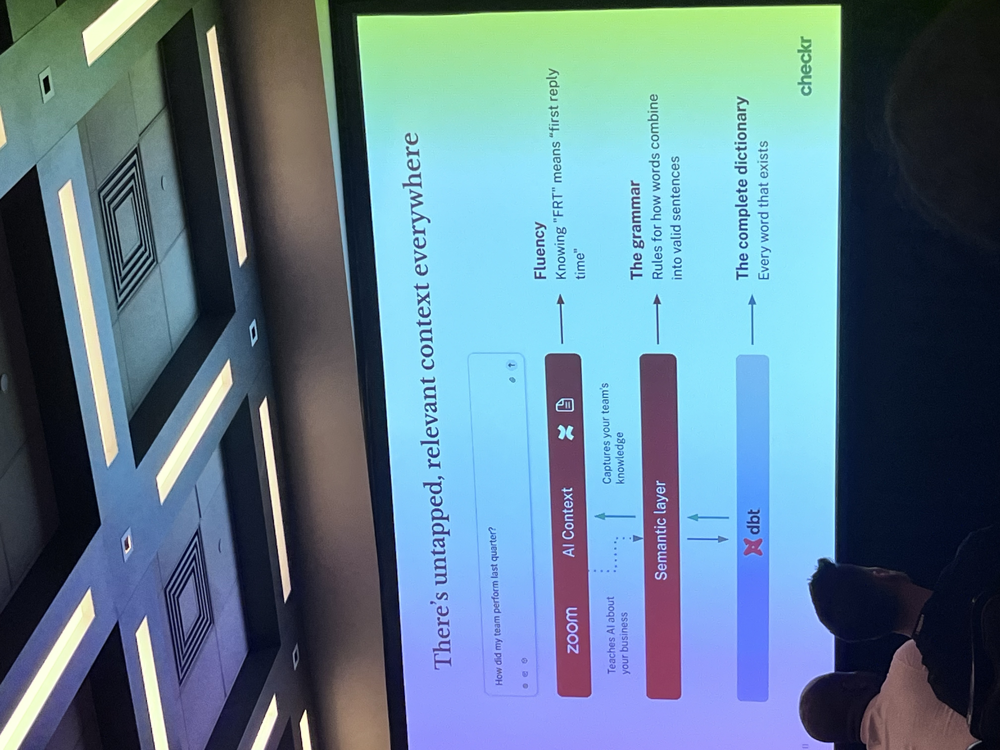

- 가장 신선했던 지점은 Checkr 사례였습니다. Checkr에는 6,000개가 넘는 dbt 모델이 있었고, AI Agent를 여기에 연결하면 Agent가 어떤 테이블과 필드를 봐야 하는지부터 찾아야 했습니다. 발표자는 같은 질문을 여러 번 던졌을 때 매번 다른 틀린 답을 받았고, 이를 **metric drift**라고 설명했습니다.

- 특히 FRT(First Reply Time) 예시가 기억에 남았습니다. FRT는 지원 요청에 사람이 얼마나 빠르게 응답했는지를 보는 Checkr의 핵심 SLA 지표인데, AI Agent는 필드명과 테이블 구조만 보고는 FRT가 무엇인지, 90%라는 기준이 무엇을 의미하는지, 어떤 예외 상황이 있는지 알 수 없습니다. 이 부분은 단순히 Semantic Layer가 필요하다는 이야기를 넘어, 조직의 업무 언어를 AI가 어떻게 배워야 하는지에 대한 문제로 들렸습니다.

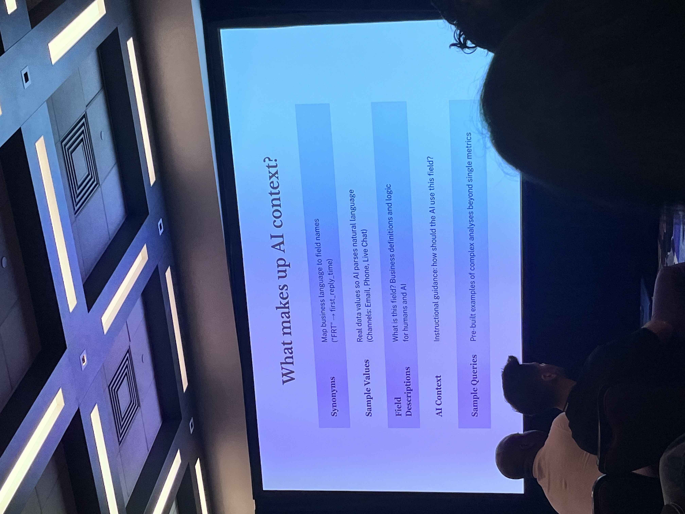
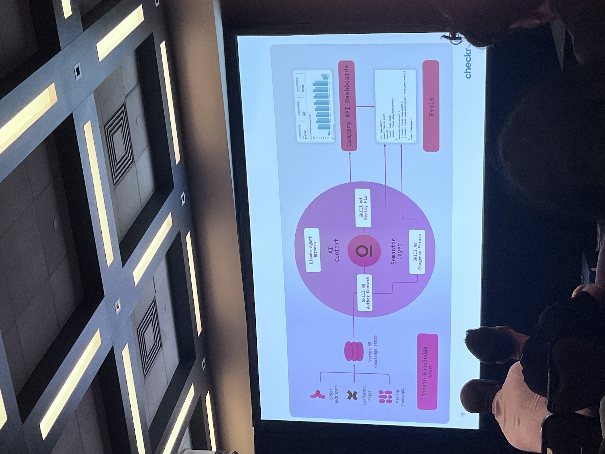

- 발표에서는 AI Context를 몇 가지 구성요소로 나눠 설명했습니다. 이해관계자가 실제로 쓰는 용어를 데이터 모델 필드와 연결하는 동의어, 자연어 파싱을 돕는 샘플 값, 필드의 비즈니스 정의, 그리고 Agent에게 행동 지침을 주는 자유 형식의 AI Context 필드가 있었습니다. (다들 비슷하게 구성이 되네요..)

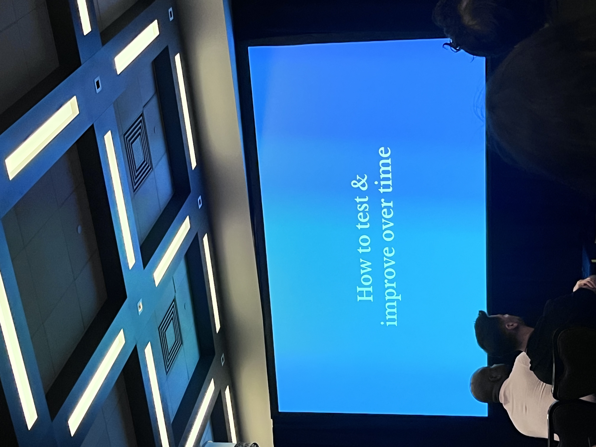
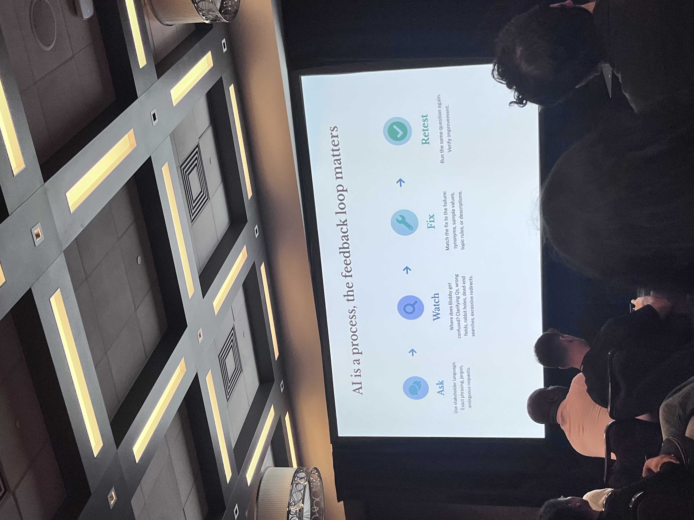

- 또 하나 좋았던 점은 피드백 루프였습니다. Context Engineering을 “한 번 문서화하고 끝”으로 보지 않고, 실제 질문과 실패 사례를 모아 계속 개선하는 운영 방식으로 설명했습니다.
- Agent가 잘못된 필드를 고르거나, 불필요하게 질문을 되묻거나, 비즈니스 질문에서 벗어나는 지점을 관찰하고, 그 실패 유형에 맞춰 동의어/샘플 값/행동 지침을 보완하는 방식입니다.
- 이 흐름은 현재 제가 고민하고 있는 Evaluation과도 연결됐습니다. AI Agent를 붙이는 것보다 더 어려운 일은, Agent가 틀렸을 때 왜 틀렸는지 분류하고 다음 시도에서 나아지게 만드는 구조를 만드는 일이라는 생각이 들었습니다.

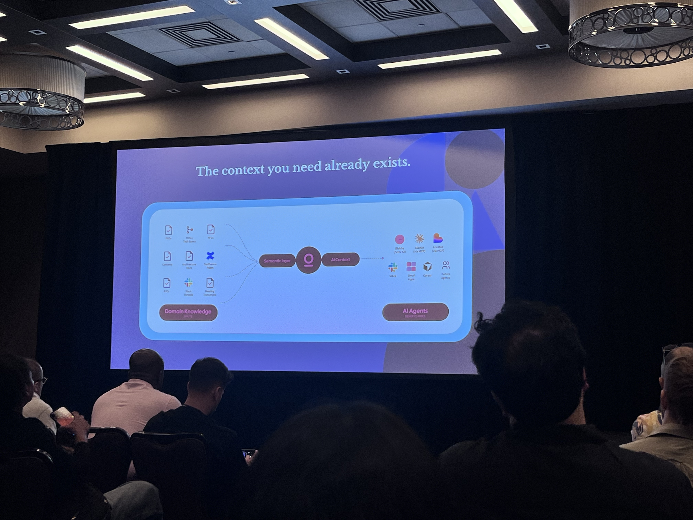
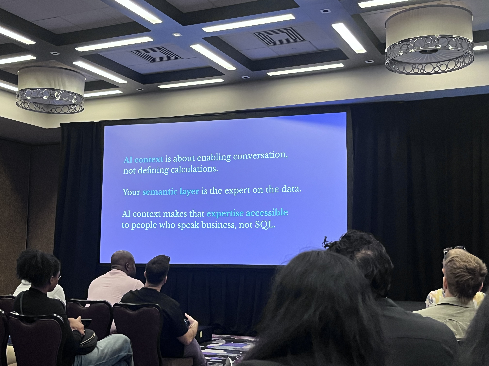

- 마지막으로 인상적이었던 메시지는 **이미 가지고 있는 컨텍스트를 활용하라**는 것이었습니다. Confluence 문서, 회의록, PRD, 기술 명세서, Slack 스레드처럼 회사 안에는 이미 많은 업무 맥락이 있습니다. 발표에서는 새로운 지식을 억지로 만들어내기보다, 사람들이 실제로 지표와 예외 상황을 설명한 흔적을 모아 AI Context로 구조화해야 한다고 했습니다.

- 그리고 모든 컨텍스트를 무작정 넣는 것도 답은 아니었습니다. Q&A에서는 컨텍스트를 많이 넣으면 토큰 사용량과 응답 시간이 늘어날 수 있다는 이야기가 나왔고, 비용을 줄이려면 토픽 안의 필드 수를 줄이는 것이 중요하다고 했습니다. 결국 **less is more**에 가깝게, 실패 유형에 맞는 컨텍스트만 선별적으로 보완해야 한다는 점이 좋았습니다.

### 총평

정리하면, 이 세션에서 새롭게 가져간 포인트는 “AI Context는 많이 넣는 것이 아니라, 실패를 줄이는 방향으로 설계해야 한다”였습니다. 좋은 Semantic Layer를 만드는 것에서 한 단계 더 나아가, 실제 질문과 실패 사례를 바탕으로 Agent가 이해해야 할 업무 언어를 계속 정제하는 일이 Context Engineering에 가깝다고 느꼈습니다.

---

## 점심: 단백질 위주로 든든하게

점심은 단백질 위주로 꽤 든든하게 먹었습니다. 컨퍼런스 일정이 길어질수록 점심을 잘 먹는 게 중요하더라구요. 식사 중에는 간단한 스몰토크도 나누고, 다시 다음 세션장으로 이동했습니다.

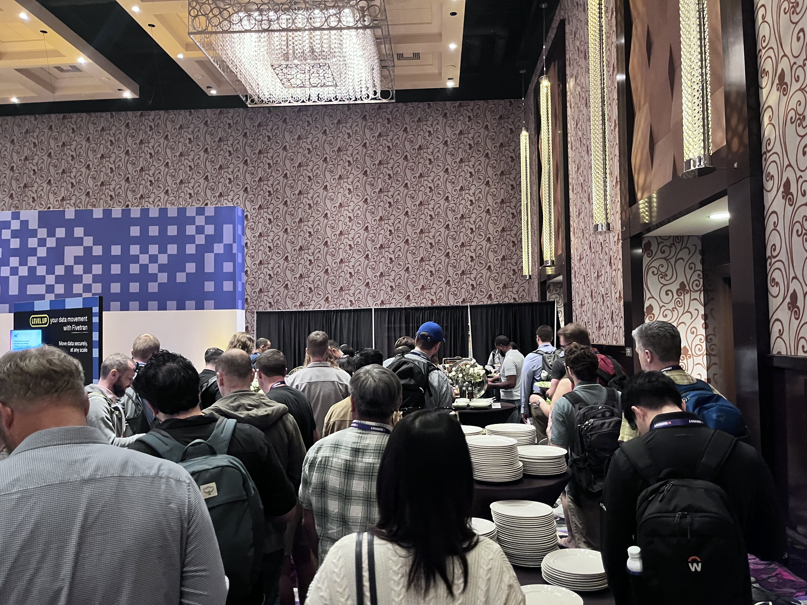
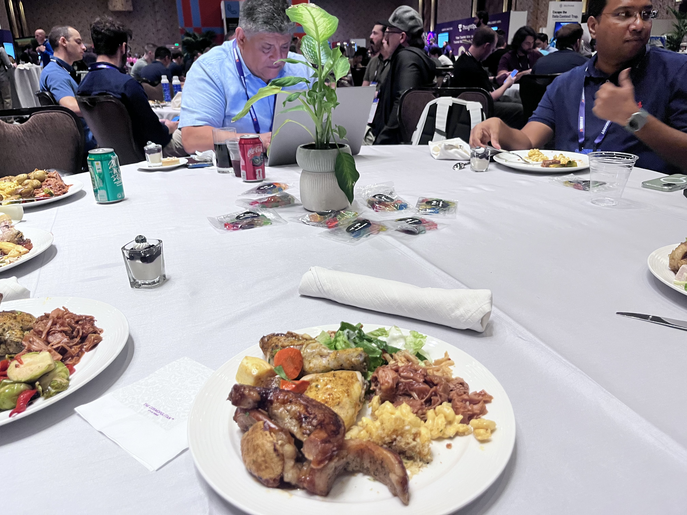

30분만에 빠른 식사를 마치고 다음 세션으로 이동했습니다.
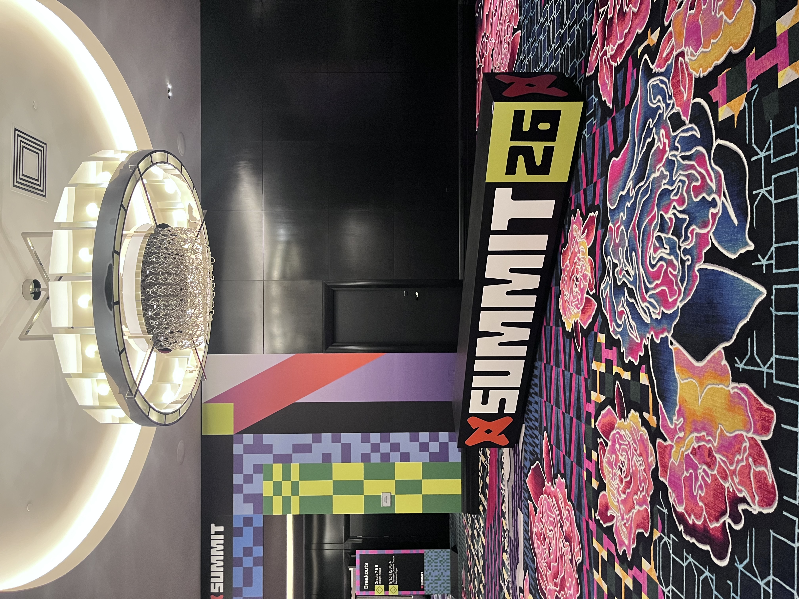

---

## Ramp's Internal AI Stack

오후에는 **Ramp's Internal AI Stack** 세션에 참석했습니다. 앞선 세션들이 Semantic Layer와 Context Engineering에 가까웠다면, 이 세션은 Ramp가 사내에서 AI를 어떻게 실제 업무 도구로 만들고 있는지 보여주는 사례에 가까웠습니다.

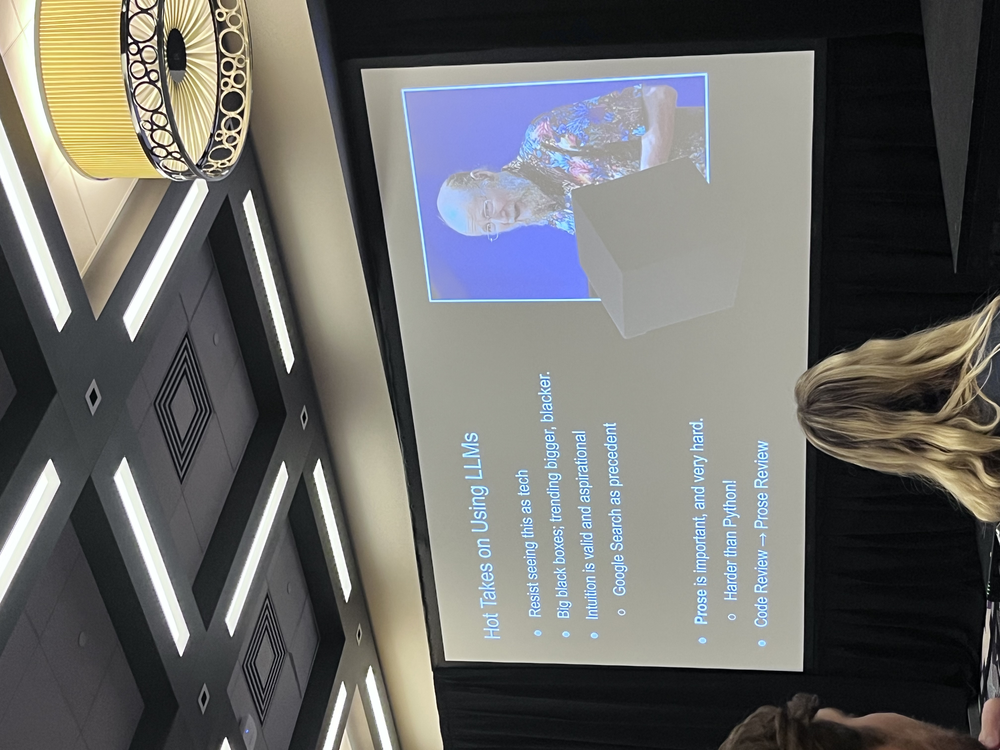
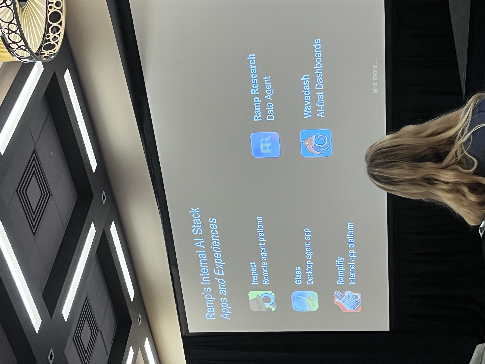

- 발표자는 분석가에서 시작해 Analytics Engineering을 거쳐 Internal AI 쪽으로 역할이 확장된 흐름을 이야기했습니다.
- 데이터 실무자가 직접 인사이트를 만드는 것도 중요하지만, 다른 사람들이 더 빨리 판단하고 실행할 수 있는 환경을 만드는 일이 더 큰 임팩트를 만들 수 있다는 관점이었습니다.
- 특히 Analytics Engineering에서 Internal AI로의 확장을 완전히 새로운 역할이라기보다, 사람들이 더 많은 일을 할 수 있도록 기반을 만드는 일이라는 점에서 비슷한 문제를 푸는 과정으로 설명한 점이 인상적이었습니다.

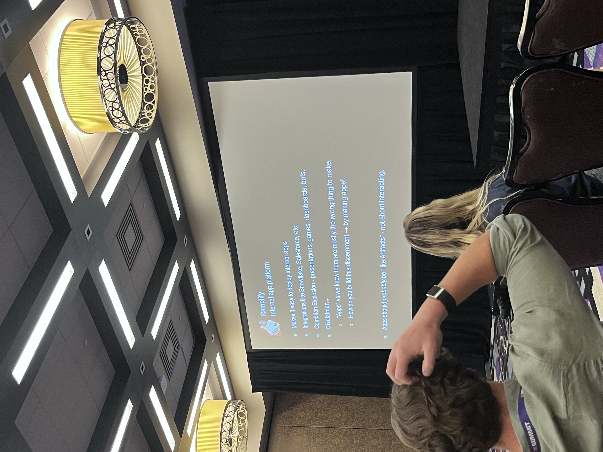
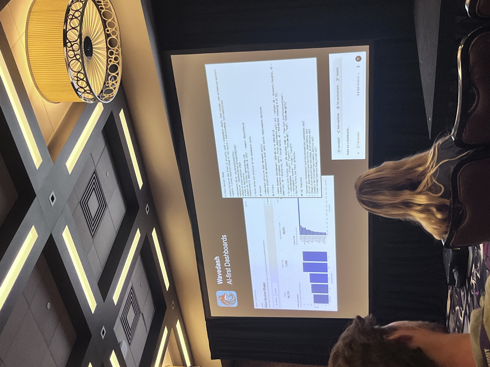

- Ramp는 외부 솔루션을 기다리기보다 내부에서 직접 실험하고 프로토타입을 만들며 감각을 쌓는 쪽에 가까웠습니다.
- 이 과정에서 추론 비용도 많이 쓰고 실패도 겪지만, 성공한 패턴만 골라 조직의 기술적 우위로 가져가는 방식이었습니다.
- 특정 모델이나 벤더에 종속되지 않기 위해 여러 모델을 유연하게 바꿔 쓸 수 있는 구조를 만들려는 점도 인상적이었습니다.
- 조직안에 사용중인 Internal AI를 하나의 기능이나 제품으로 보기보다는, Remote Agent, Desktop Agent, Data Agent, Internal App, Dashboard 등이 연결된 하나의 Stack으로 설명했습니다.
   - Modern Data Stack에서 Ingestion, Transformation, Orchestration 등이 각각 하나의 영역으로 발전했던 것처럼 Internal AI 역시 여러 영역으로 나뉘어 발전할 수 있다는 관점으로 보였습니다.

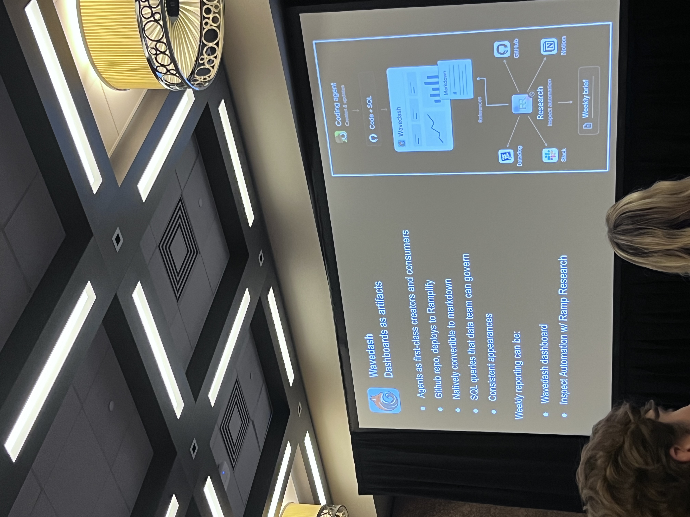
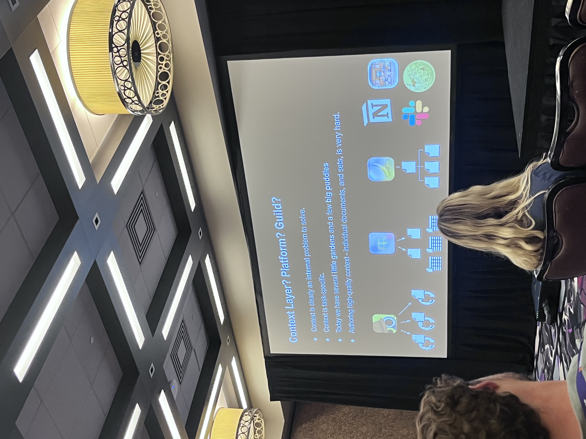

- 또한 LLM을 많이 사용하면서 모델이 어떤 상황에서 잘 동작하고 실패하는지에 대한 직관을 쌓는 것 자체도 중요한 역량이라고 이야기했습니다.
- 특히 Analytics Engineer가 가진 비즈니스와 데이터에 대한 이해뿐 아니라, 글을 통해 정의와 Context를 명확하게 전달하는 능력 역시 AI 시대에 중요한 강점이 될 수 있다는 관점이었습니다.
- Context가 하나의 Layer가 될지 Platform이 될지는 아직 명확하지 않지만, 처음부터 완벽한 플랫폼을 설계하기보다는 먼저 필요한 Context를 만들고 실제 Agent에서 활용하면서 발전시키는 방식을 강조했습니다.

### 총평
- 그 외에도 글쓰기 문화에 대한 이야기도 진행했는데요. LLM 시대에는 프롬프트, 정책, 문서, 업무 컨텍스트가 모두 시스템의 동작에 영향을 주기때문에, 글을 잘 쓰고, 리뷰하고, 조직 안에 남기는 일이 더 이상 부수적인 일이 아니라는 메시지로 들렸습니다.
- 이 세션에서 새롭게 가져간 포인트는 내부 AI를 “몇 개의 기능”이 아니라 **조직이 AI를 쓰는 방식 자체를 설계하는 일**로 봐야 한다는 점이었습니다.
- 데이터 플랫폼과 Analytics Engineering도 결국 데이터를 잘 제공하는 것을 넘어, 사람과 Agent가 함께 데이터를 이해하고 실제 업무를 수행할 수 있는 기반을 만드는 방향으로 확장될 수 있겠다는 생각이 들었습니다.

---

## All Aboard: Rebuilding dbt in the Open

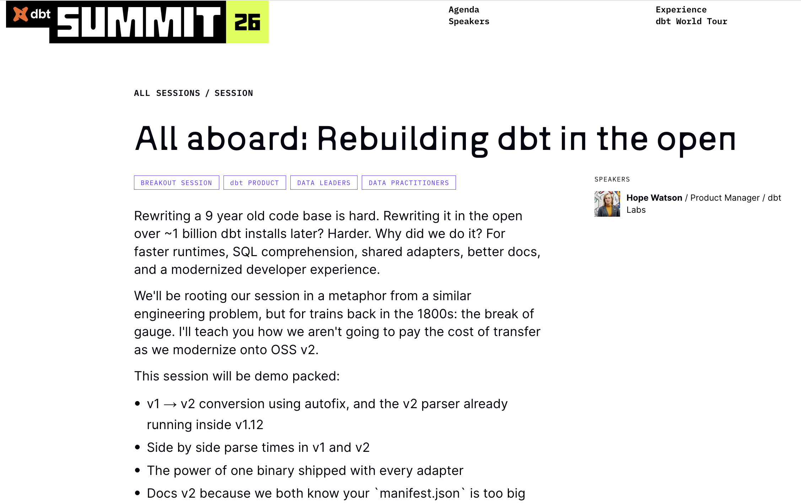

마지막으로는 **All Aboard: Rebuilding dbt in the Open** 세션을 들었습니다. 현장 사진은 남기지 못했지만, 핵심은 dbt v1 사용자를 v2로 어떻게 안전하게 옮길 것인가였습니다.

- 가장 인상적이었던 부분은 v1 환경에서 v2 Parser를 먼저 실행해, 기존 프로젝트가 v2에서 어디서 깨질 수 있는지 미리 확인하는 흐름이었습니다. 데모에서는 deprecation warning과 호환성 이슈를 찾고, AutoFix로 일부 문제를 자동 수정한 뒤 변경 사항을 개발자가 검토하는 과정이 소개되었습니다.

- 또 하나는 **One Binary** 방향이었습니다. 기존에는 Snowflake, Spark처럼 플랫폼마다 adapter와 dependency를 따로 관리해야 했는데, v2에서는 adapter를 더 단일한 실행 구조로 가져가 복잡성을 줄이려는 모습이었습니다.

- 정리하면 이 세션은 “새 기능”보다 “전환 비용을 낮추는 설계”에 가까웠습니다. 이미 많은 모델과 adapter를 운영하는 팀이 v2로 넘어갈 때, 먼저 검사하고 자동 수정하고 복잡한 의존성을 줄이는 흐름이 현실적으로 느껴졌습니다.

---

## 종료 후 스트립 감상, 벨라지오 분수쇼

세션이 끝난 뒤에는 잠깐 스트립을 걸으며 라스베이거스 분위기를 다시 느꼈습니다. 컨퍼런스 일정 내내 호텔과 세션장을 오가다 보니, 막상 라스베이거스에 와 있다는 느낌을 천천히 받을 시간이 많지는 않았습니다.
실제로 시차때문에 너무 고통받고 있어서, 즐길 시간이 충분하지 않았네요.. ㅎ

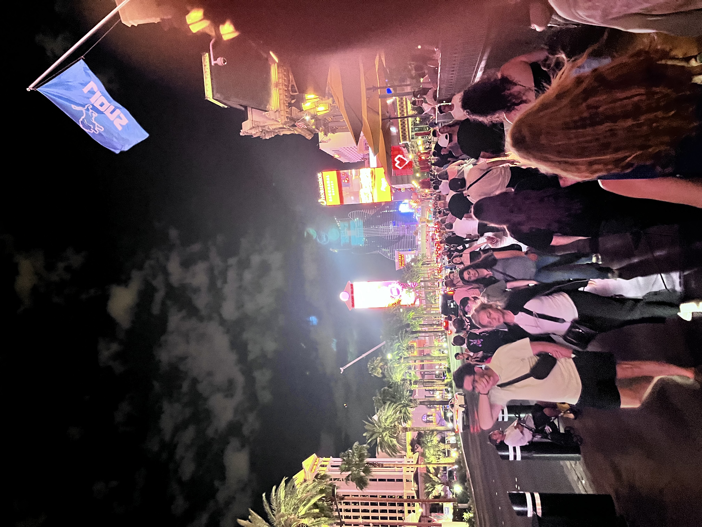

마지막에는 벨라지오 분수쇼도 구경했습니다. 낮에는 계속 세션을 들으며 머리를 쓰고, 밤에는 이런 풍경을 보니 확실히 라스베이거스다운 하루라는 생각이 들었습니다.

---

## 3일차 총평

3일차를 돌아보면, 전날보다 훨씬 더 명확하게 하나의 메시지가 보였습니다. AI Agent 시대의 데이터 플랫폼은 단순히 모델을 잘 만들고, 대시보드를 잘 제공하는 수준에서 끝나지 않습니다. 이제는 데이터의 의미, 업무 용어, Metric 정의, 조인 관계, 사용 권한, 검증된 질문, 조직의 암묵지까지 함께 관리해야 합니다.

Sigma 세션은 Semantic Layer가 BI 제품과 dbt 프로젝트 안에서 어떻게 코드화될 수 있는지 보여줬고, Context Engineering 세션은 그 의미 계층이 AI Agent와 비즈니스 사용자에게 왜 필요한지 설명했습니다. Ramp 세션은 한 걸음 더 나아가, 조직 전체가 AI를 업무 도구로 쓰기 위해 어떤 내부 스택과 문화를 만들어야 하는지 보여줬습니다. 마지막 All Aboard 세션은 dbt 자체가 v2로 이동하면서 기존 생태계를 어떻게 안전하게 데려갈지에 대한 이야기였습니다.

개인적으로 가장 크게 남은 키워드는 **Context**였습니다. 좋은 모델을 쓰는 것도 중요하지만, 모델이 사용할 수 있는 좋은 컨텍스트를 준비하는 일이 더 중요해지고 있습니다. 데이터 엔지니어링과 Analytics Engineering의 역할도 이 방향으로 조금씩 이동할 것 같습니다. 테이블을 만드는 일에서 끝나는 것이 아니라, 사람이든 Agent든 데이터를 올바르게 이해하고 사용할 수 있도록 의미와 근거를 함께 설계하는 일이 앞으로 더 중요해질 것 같습니다.

다음 글에서는 마지막 일정과 복귀하면서 정리한 생각을 이어서 남겨보겠습니다. 👋
