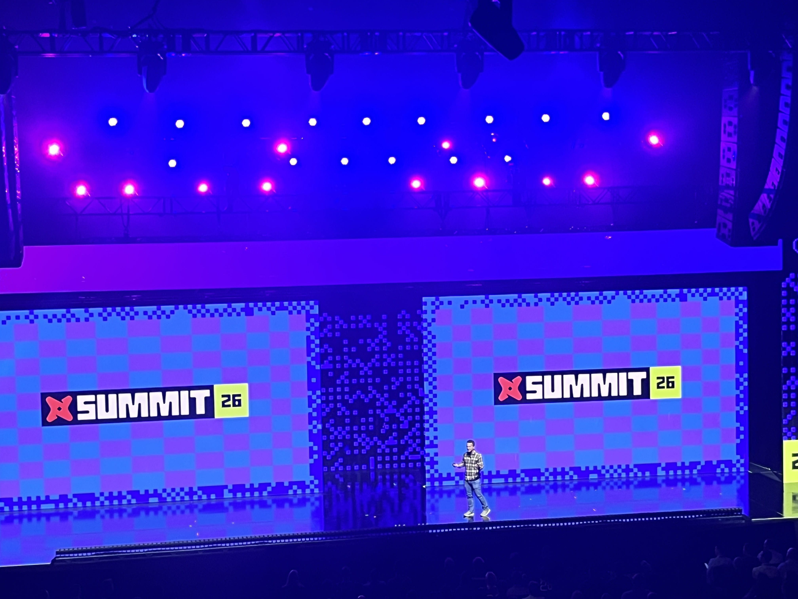
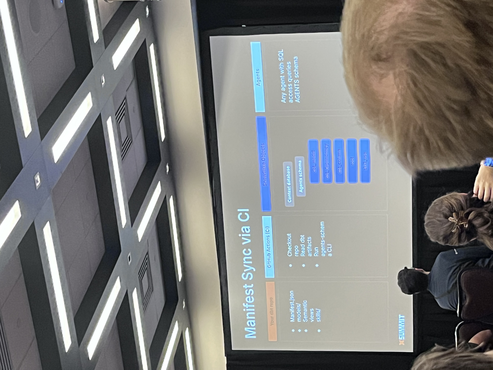

dbt Summit 2026에 참석했다. 행사장의 풍경부터 발표 슬라이드까지, 사진과 함께 이번 서밋의 기록을 남겨본다.

<!-- 여기에 참석 계기와 기대했던 점을 적어주세요. -->

## 행사장에서

_행사 등록대. 안내판 앞에 참가자들이 줄을 서 있다._

등록 공간부터 무대까지 Summit의 로고와 색상이 이어진다. 사진에는 등록을 기다리는 사람들과 발표가 진행되는 무대가 담겨 있다.

_SUMMIT 26 로고가 띄워진 무대의 모습._

<!-- 여기에 현장 분위기와 기억에 남는 장면을 적어주세요. -->

## 사진으로 남긴 세션

### dbt 프로젝트의 정보를 에이전트에 연결하는 흐름

_Manifest Sync via CI 슬라이드. 저장소, CI, Snowflake 객체, 에이전트가 차례로 배치돼 있다._

<!-- 여기에 세션명, 발표 내용, 기억에 남는 점을 적어주세요. -->

### 여러 종류의 지식을 묶는 Fivetran Context Layer

_Fivetran Context Layer 슬라이드. 서로 다른 소스의 지식이 웨어하우스와 에이전트로 이어지는 구성이 보인다._

<!-- 여기에 발표 내용과 나의 생각을 적어주세요. -->

## 내 업무와 연결해보기

<!-- 여기에 업무에 적용하고 싶은 점과 직접 시도해볼 일을 적어주세요. -->

## 돌아보며

<!-- 여기에 전체 소감과 동료에게 공유하고 싶은 내용을 적어주세요. -->

<!--
작성 메모 — 발행 전 정리:
- 개인 세션 메모가 아직 제공되지 않아 사진 중심으로 구성했다.
- 전체 337장 중 일부를 살펴보고 본문에 직접 설명할 수 있는 120, 190, 230, 240번을 임시 선정했다.
- 원본 폴더: /Users/user/Documents/출장/dbt summit 2026/후기 사진
- 위 네 파일을 src/assets/blog/dbt-summit-2026/로 같은 이름으로 복사했다.
- 촬영 시각, 날짜별 세션 순서, 발표자 신원은 사진 번호로 추정하지 않았다.
- 본문은 사진 배치를 보기 위한 초안이며, 세션 상세와 소감은 작성자가 직접 추가한다.
-->
